# TURIA - CA Practice Management & Compliance Platform
## Product Feature Specifications, UI References & Schema Blueprint

This document is the **single source of truth** for all product features, UI wireframes, data structures, and database schemas for the **TURIA CA Practice Management Platform**.

---

## Table of Contents

1. [Application Shell & Global Navigation](#1-application-shell--global-navigation)
2. [Home Dashboard & Tabbed Workspace](#2-home-dashboard--tabbed-workspace)
   - [2.1 Onboarding & Multi-Step Profile Setup (5 Steps)](#21-onboarding--multi-step-profile-setup-5-steps)
   - [2.2 Tab 1: Attendance & Punch-In Hub](#22-tab-1-attendance--punch-in-hub)
   - [2.3 Tab 2: TimeSheet & Weekly Matrix](#23-tab-2-timesheet--weekly-matrix)
   - [2.4 Tab 3: Sales & Financial Dashboard](#24-tab-3-sales--financial-dashboard)
   - [2.5 Tab 4: Quick Notes & Auto-Saving Scratchpad](#25-tab-4-quick-notes--auto-saving-scratchpad)
   - [2.6 Slide-Over Profile & Firm Utility Drawer](#26-slide-over-profile--firm-utility-drawer)
3. [User Profile, Member Portal & Org Chart Module](#3-user-profile-member-portal--org-chart-module)
   - [3.1 Tab 1: Profile Details & Monthly Attendance Calendar](#31-tab-1-profile-details--monthly-attendance-calendar)
   - [3.2 Tab 2: Personal Reimbursement Claims](#32-tab-2-personal-reimbursement-claims)
   - [3.3 Tab 3: Assigned Tasks & Re-Assignment](#33-tab-3-assigned-tasks--re-assignment)
   - [3.4 Tab 4: Assigned Clients Portfolio](#34-tab-4-assigned-clients-portfolio)
   - [3.5 Tab 5: Employee KYC & Document Vault](#35-tab-5-employee-kyc--document-vault)
   - [3.6 Tab 6: 30-Module Granular RBAC Permissions Matrix](#36-tab-6-30-module-granular-rbac-permissions-matrix)
   - [3.7 Tab 7: Organization Hierarchy Tree Canvas](#37-tab-7-organization-hierarchy-tree-canvas)
4. [Leads Management & Client Acquisition Engine](#4-leads-management--client-acquisition-engine)
   - [4.1 Leads KPI Strip & Metrics](#41-leads-kpi-strip--metrics)
   - [4.2 Leads Data Table & Column Customization](#42-leads-data-table--column-customization)
   - [4.3 Dynamic Filter Bar & Sliders](#43-dynamic-filter-bar--sliders)
   - [4.4 Add Lead Modal & GSTIN Verification](#44-add-lead-modal--gstin-verification)
   - [4.5 Import / Export & Document Actions](#45-import--export--document-actions)
5. [Client Master & Entity Directory](#5-client-master--entity-directory)
   - [5.1 Client KPI Strip & Activity Tracking](#51-client-kpi-strip--activity-tracking)
   - [5.2 Client Data Table & Column Specifications](#52-client-data-table--column-specifications)
   - [5.3 Add Client Form & GST Verification](#53-add-client-form--gst-verification)
   - [5.4 Import Clients & Downloadable XLSX Sample Specification](#54-import-clients--downloadable-xlsx-sample-specification)
   - [5.5 Multi-Entity Groups, Contacts & Multi-GSTIN Support](#55-multi-entity-groups-contacts--multi-gstin-support)
6. [Services Catalog & Master Repository](#6-services-catalog--master-repository)
   - [6.1 Services KPI Strip & Metrics](#61-services-kpi-strip--metrics)
   - [6.2 Services Data Table & Columns](#62-services-data-table--columns)
   - [6.3 Add New Service Modal & Commercial Configuration](#63-add-new-service-modal--commercial-configuration)
   - [6.4 Downloadable Service Sample XLSX & Multi-Sheet Structure](#64-downloadable-service-sample-xlsx--multi-sheet-structure)
   - [6.5 Sub-Task Templates & Document Checklist Configuration](#65-sub-task-templates--document-checklist-configuration)
7. [Task & Statutory Compliance Management Engine](#7-task--statutory-compliance-management-engine)
   - [7.1 Tab 1: Task Summary Matrix & Logarithmic Heatmap](#71-tab-1-task-summary-matrix--logarithmic-heatmap)
   - [7.2 Tab 2: Task List & Comprehensive Filter Drawer](#72-tab-2-task-list--comprehensive-filter-drawer)
   - [7.3 Tab 3: Sub-Tasks Execution & Verification Pipeline](#73-tab-3-sub-tasks-execution--verification-pipeline)
   - [7.4 Tab 4: Recurring Compliance Schedule & FY Calendar](#74-tab-4-recurring-compliance-schedule--fy-calendar)
   - [7.5 Tab 5: Analytics & 12 Management MIS Reports](#75-tab-5-analytics--12-management-mis-reports)
   - [7.6 Add Task Modal & Proforma Invoice Linking](#76-add-task-modal--proforma-invoice-linking)
   - [7.7 Slide-Over Task Activity & Audit Trail Drawer](#77-slide-over-task-activity--audit-trail-drawer)
8. [Invoice, Billing & Receipts Engine](#8-invoice-billing--receipts-engine)
   - [8.1 Tab 1: Proforma Invoice Management](#81-tab-1-proforma-invoice-management)
   - [8.2 Tab 2: Tax Invoice Management](#82-tab-2-tax-invoice-management)
   - [8.3 Tab 3: Pass-Through Reimbursements](#83-tab-3-pass-through-reimbursements)
   - [8.4 Tab 4: Payment Receipts & Advance Tracking](#84-tab-4-payment-receipts--advance-tracking)
   - [8.5 Tab 5: Recurring Invoice Engine](#85-tab-5-recurring-invoice-engine)
   - [8.6 Tab 6: Sales Analytics & GSTR-1 Outward Supplies Report](#86-tab-6-sales-analytics--gstr-1-outward-supplies-report)
   - [8.7 Add Proforma / Tax Invoice Screen](#87-add-proforma--tax-invoice-screen)
9. [Team & Staff Management Module](#9-team--staff-management-module)
   - [9.1 Tab 1: Team Directory & License Seat Tracker](#91-tab-1-team-directory--license-seat-tracker)
   - [9.2 Tab 2: Attendance & Geofenced Clock-In Tracking](#92-tab-2-attendance--geofenced-clock-in-tracking)
   - [9.3 Tab 3: Leave Management & CA Exam Study Leave Pipeline](#93-tab-3-leave-management--ca-exam-study-leave-pipeline)
   - [9.4 Tab 4: Employee Expense Reimbursement Claims](#94-tab-4-employee-expense-reimbursement-claims)
   - [9.5 Add Employee 4-Step Stepper Wizard](#95-add-employee-4-step-stepper-wizard)
10. [Reports & Executive MIS Analytics Hub](#10-reports--executive-mis-analytics-hub)
    - [10.1 6-Category Executive MIS Grid](#101-6-category-executive-mis-grid)
    - [10.2 Team MIS & Article Trainee Stipend Reports](#102-team-mis--article-trainee-stipend-reports)
    - [10.3 Task & Workflow MIS Reports](#103-task--workflow-mis-reports)
    - [10.4 Sales & Billing MIS Reports](#104-sales--billing-mis-reports)
    - [10.5 Statutory Form ADT-1 & Profitability Reports](#105-statutory-form-adt-1--profitability-reports)
11. [Statutory Registry Module & DSC Physical Vault](#11-statutory-registry-module--dsc-physical-vault)
    - [11.1 DSC Physical Vault & Signatory Register](#111-dsc-physical-vault--signatory-register)
    - [11.2 DSC Expiry Warning Pipeline (30d & 15d)](#112-dsc-expiry-warning-pipeline-30d--15d)
    - [11.3 Token Location & Bin Vault Management](#113-token-location--bin-vault-management)
    - [11.4 Client Licenses & Statutory Registrations](#114-client-licenses--statutory-registrations)
12. [Database Schemas & TypeScript Mock Data Models](#12-database-schemas--typescript-mock-data-models)
    - [12.1 Supabase PostgreSQL DDL (`schema.sql`)](#121-supabase-postgresql-ddl-schemasql)
    - [12.2 TypeScript Types & Mock Data Fixtures (`types.ts`)](#122-typescript-types--mock-data-fixtures-typests)
13. [UI / UX Design System & Layout Tokens](#13-ui--ux-design-system--layout-tokens)
14. [Screenshot Reference Catalog](#14-screenshot-reference-catalog)

---

## 1. Application Shell & Global Navigation

```
┌──────┬──────────────────────────────────────────────────────────────────────────────────────────────────┐
│      │ Topbar: [Logo] [Firm Name: Saha And Sons]  [Tools: Notices, Compliance, WhatsApp, Email,        │
│      │         Agents (NEW), Chat, Sprints, Action-Center, Calendar, To-Do] [Search] [Theme] [Avatar]   │
│      ├──────────────────────────────────────────────────────────────────────────────────────────────────┤
│ Left │ Profile Banner: [0% Gauge] "Welcome archi - Complete profile setup (5 steps)" [Complete Profile]  │
│ Side ├──────────────────────────────────────────────────────────────────────────────────────────────────┤
│ Bar  │ Active View (Home / Leads / Client Master / Services / Tasks / Invoices / Team / Reports/ Registry)│
│ Icons│                                                                                                  │
│  &   │                                                                                                  │
│ Labels│                                                                                                 │
│      ├──────────────────────────────────────────────────────────────────────────────────────────────────┤
│      │ Footer: © 2026, Powered by TURIA                                            [⚙️ Customizer Tool] │
└──────┴──────────────────────────────────────────────────────────────────────────────────────────────────┘
```

### 1.1 Left Sidebar Navigation
- **Home**: Attendance punch-in, Timesheet matrix, Sales dashboard, Quick Notes.
- **Leads**: Pipeline tracking, 6 KPI cards, 13-column table, filter bar with dual-thumb sliders, Add Lead modal with live GSTIN verification, CSV Import/Export.
- **Client**: Client Master, 4 KPI cards, 13-column table, Add Client form with GSTIN verify, 24-column XLSX import/export, Client Groups, Multi-state GSTINs.
- **Services**: Master service catalog, 6 KPI cards, 12-column table, Add Service modal with SAC codes/TAT/OOP budget, 3-sheet XLSX template with 18 columns, sub-task checklists.
- **Task**: 5-tab statutory compliance pipeline: Task Summary Matrix with Heatmap, Task List with 10 KPI cards and Filter Drawer, Sub-Tasks pipeline, Recurring Schedules, and 12 Analytics MIS Reports.
- **Invoice**: 6-tab billing engine: Proforma Invoices, Tax Invoices, Pass-Through Reimbursements, Payment Receipts, Recurring Invoices, Sales Analytics & GSTR-1 Outward Supplies Report.
- **Team**: 4-tab staff management: Team Directory with license seat tracker, Geofenced GPS attendance with regularization, Leave tracking for CA exam study leaves, Internal employee expense claims, 4-step Add Employee wizard.
- **Reports**: 6-category executive MIS grid across Team, Tasks, Sales, DSC Register, Licenses, and Statutory ADT-1/Profitability.
- **Registry**: Digital Signature Certificate (DSC) physical token vault, 30d/15d expiry alerts, Bin location tracking, Vendor & Class 3 directory.

### 1.2 Top Navigation Bar Shortcuts
- `Notices` (Badge: "ADD ON")
- `Compliance` (Statutory compliance calendar)
- `WhatsApp` (Client communication)
- `Email` (Dispatch acknowledgments)
- `Agents` (Badge: "NEW" - AI tax notice & OCR assistants)
- `Chat` (Internal firm messaging)
- `Sprints` (Audit & filing sprint cycles)
- `Action-Center` (Pending approvals & urgent tasks)
- `Calendar` (Court/hearing & deadline calendar)
- `To-Do` (Personal task checklist)

---

## 2. Home Dashboard & Tabbed Workspace

### 2.1 Onboarding & Multi-Step Profile Setup (5 Steps)

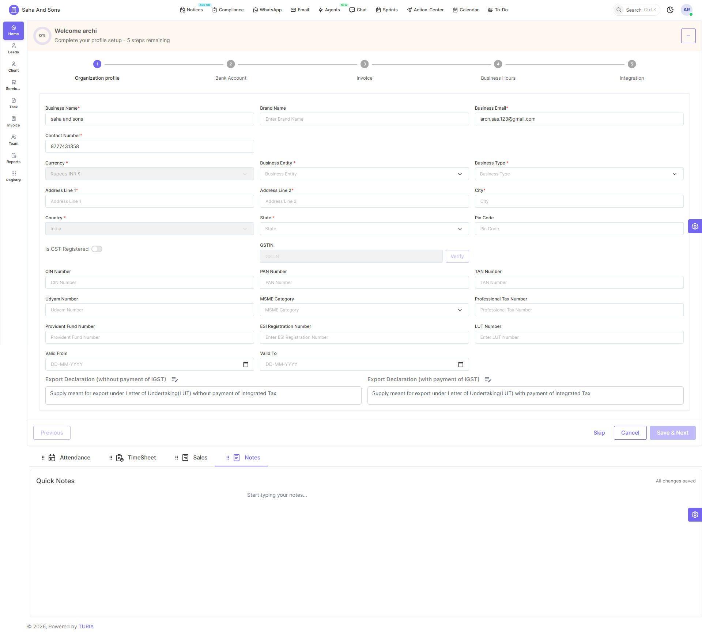

When the profile setup is incomplete, an expandable banner displays the progress gauge (`0%`) with the prompt: *"Complete your profile setup - 5 steps remaining"*.
Clicking **Complete Profile** expands the 5-step wizard:
`1. Organization profile` ➔ `2. Bank Account` ➔ `3. Invoice` ➔ `4. Business Hours` ➔ `5. Integration`.

#### Step 1: Organization Profile Details:
- Business Entity (Partnership Firm, Sole Proprietorship, LLP, Pvt Ltd, Individual CA Practice)
- Business Type (Chartered Accountant Practice, Tax Advisory, Audit & Assurance)
- Brand Name & Legal Name
- Contact Email & Phone Number
- GST Registration status, GSTIN, PAN, TAN, CIN/LLPIN, Udyam No, Profession Tax (PT), PF, ESIC, LUT details
- Address (Line 1, Line 2, City, State, Country, Pin Code)

---

### 2.2 Tab 1: Attendance & Punch-In Hub

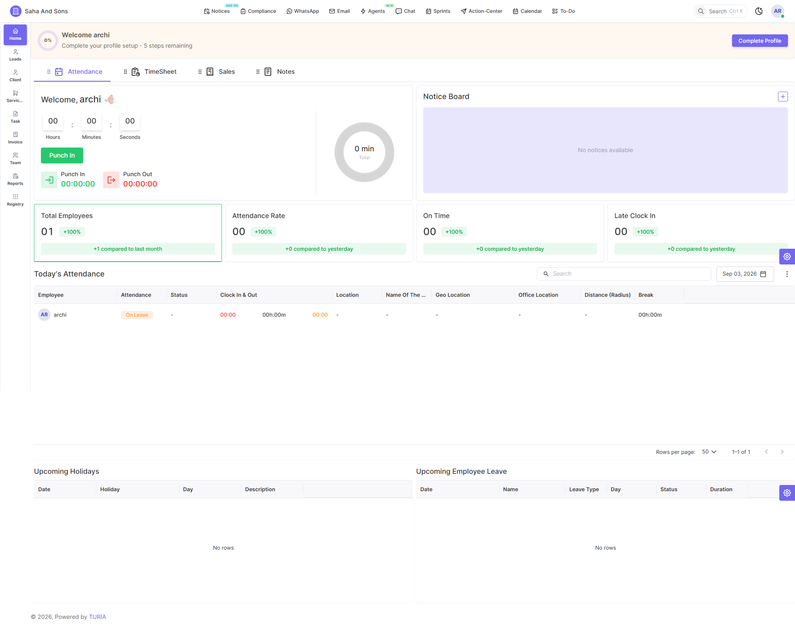

Designed for tracking office and remote attendance of CA partners, managers, paid assistants, and article trainees:
- **Timer Widget**: Live punch-in timer (`00:00:00`), Punch In/Out button, "Punch in to record your attendance".
- **Notice Board**: Firm-wide announcements with "0 new notices" counter.
- **4 Metric KPI Cards**:
  - `Total Employees`: `1` (Blue text + users icon)
  - `Attendance Rate`: `0%` (Red text + warning icon)
  - `On Time`: `0` (Green text + check icon)
  - `Late Clock In`: `0` (Orange text + clock icon)
- **Today's Attendance Table**: `Team Members`, `Status`, `Clock In`, `Clock Out`, `Total Hours`.
- **Upcoming Holidays**: Date and holiday name cards.
- **Upcoming Leaves**: Teammates on upcoming approved leave.

---

### 2.3 Tab 2: TimeSheet & Weekly Matrix

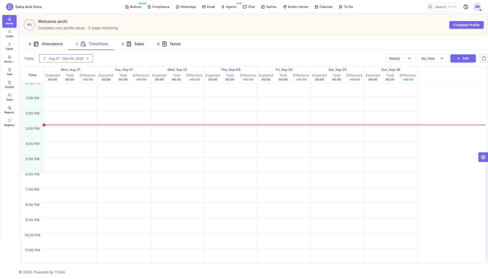

A comprehensive weekly calendar matrix for article assistants and managers to log billable hours against specific clients and statutory tasks:
- **Weekly Matrix Grid**: 7-day columns (Sun - Sat) with hourly rows from 12 PM to 11 PM.
- **Live Indicator Line**: Real-time horizontal red line indicating the current hour of the day.
- **Daily Summary Totals Strip**:
  - `Expected Hours`: Target billable hours (e.g. 8.0 hrs).
  - `Total Logged`: Actual logged hours.
  - `Difference`: Over/under variance indicator.
- **View Selectors**: `Weekly`, `My View`, `Team View`.
- **Add Time Entry Modal**: Client, Service, Task, Start Time, End Time, Description, Billable toggle.

---

### 2.4 Tab 3: Sales & Financial Dashboard

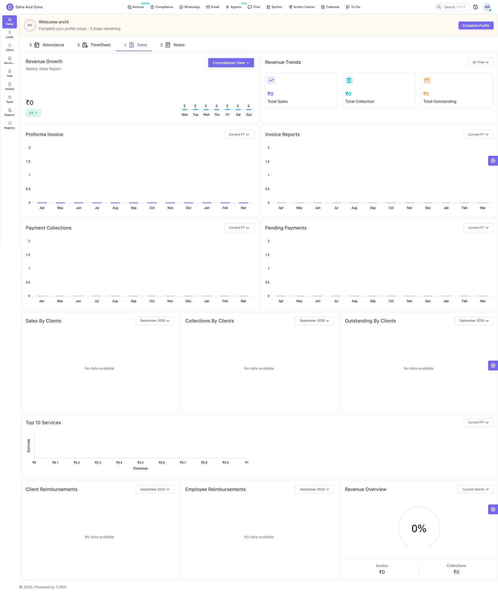

Provides partners with a comprehensive overview of billing, fee collections, outstanding debts, and service-line profitability:
- **Weekly Revenue Growth Chart**: Line chart comparing current week sales vs. previous week.
- **3 Primary Stat Cards**:
  - `Total Sales`: Gross invoiced revenue.
  - `Total Collection`: Realized payment inflows.
  - `Total Outstanding`: Uncollected fees.
- **Monthly Invoicing Charts (Apr - Mar FY)**:
  - Monthly Proforma vs. Tax Invoices bar chart.
  - Monthly Collections vs. Pending Invoices bar chart.
- **Client Financial Ranking**: Top clients sorted by billed volume, collections, and outstanding receivables.
- **Top 10 Services Horizontal Bar Chart**: Breakdown by service line (e.g. Statutory Audit, GST Filing, Tax Audit 44AB, MCA Annual Filing).
- **Reimbursements Breakdown**: Pass-through client out-of-pocket expenses vs. Internal staff reimbursements.
- **Monthly Revenue Overview Donut Chart**: Proportional share across business segments.

---

### 2.5 Tab 4: Quick Notes & Auto-Saving Scratchpad

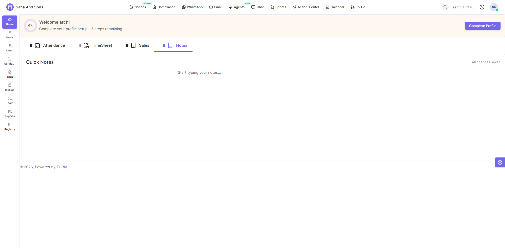

An instant practitioner scratchpad with debounced auto-save to Supabase (`All changes saved` status badge):
- Text area supporting rich notes, meeting memos, and quick task lists.
- Instant cloud persistence with zero data loss on browser refresh.

---

### 2.6 Slide-Over Profile & Firm Utility Drawer

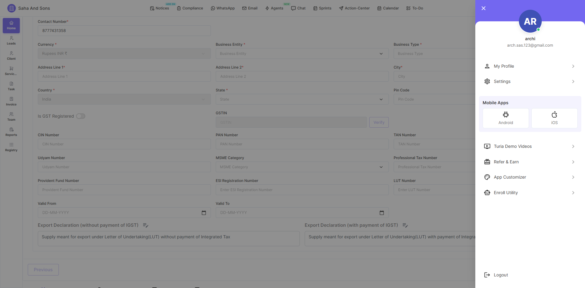

Triggered by clicking the user avatar in the topnav:
- User profile info (`archi`, `arch.sas.123@gmail.com`).
- `My Profile`: Navigates to full Profile & RBAC workspace.
- `Settings`: Workspace firm configuration.
- `Mobile App Badges`: Direct links to download Android APK / iOS app.
- `Turia Demo Videos`: Interactive video onboarding library.
- `Refer & Earn`: CA practitioner referral rewards program.
- `App Customizer`: Custom theme, layout, and table presets.
- `Enroll Utility`: Biometric punch device USB configuration.
- `Logout`: Secure Clerk session termination.

---

## 3. User Profile, Member Portal & Org Chart Module

The **User Profile Module** (`profile-1.png` to `profile-7.png`) is the central portal for individual practitioners, partners, managers, and article assistants:

```
┌────────────────────────────────────────────────────────────────────────────────────────────────────────────────────────┐
│ Tabs: [ 👤 Profile Details ] [ ₹ Reimbursement ] [ 📋 Tasks ] [ 👥 Clients ] [ 📄 Documents ] [ 🔑 Permissions ] [ 🌳 Organization ] │
└────────────────────────────────────────────────────────────────────────────────────────────────────────────────────────┘
```

---

### 3.1 Tab 1: Profile Details & Monthly Attendance Calendar

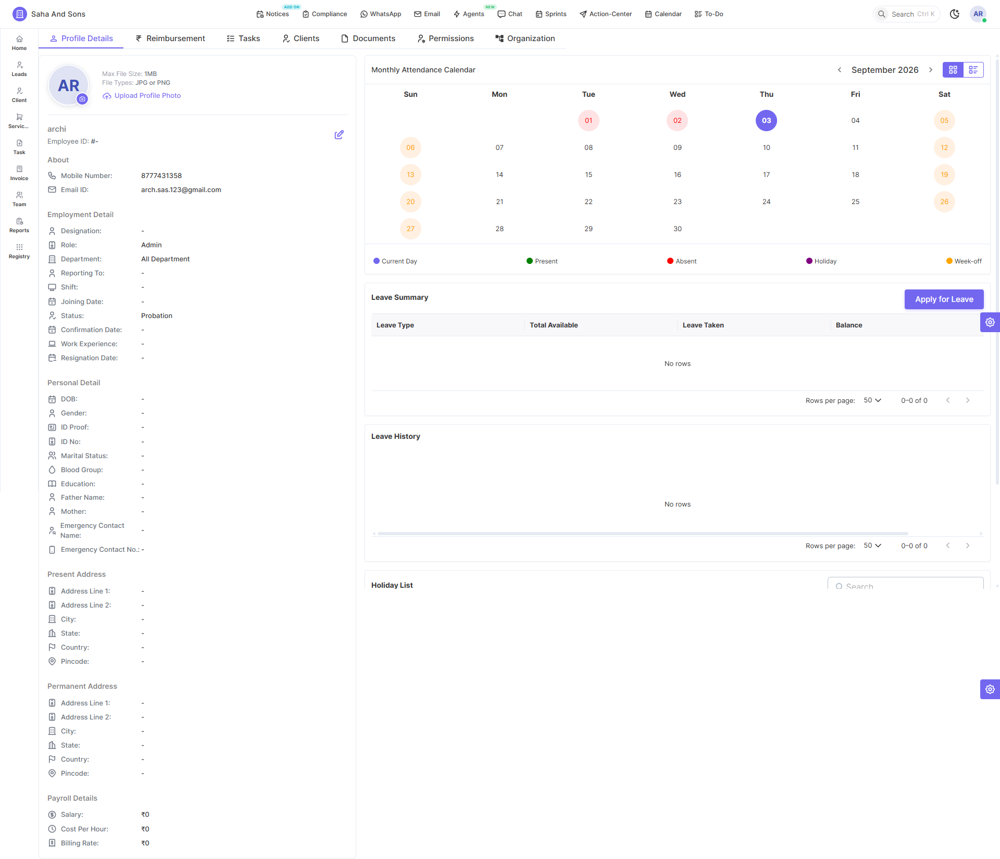

- **Left Profile Card**:
  - Avatar uploader (`Max 1MB, JPG/PNG`), Name: `archi`, Employee ID: `#-`, Edit icon (✏️).
  - **About**: Mobile Number (`8777431358`), Email ID (`arch.sas.123@gmail.com`).
  - **Employment Detail**: Designation, Role (`Admin`), Department (`All Department`), Reporting To, Shift, Joining Date, Status (`Probation`), Confirmation Date, Experience, Resignation Date.
  - **Personal Detail**: DOB, Gender, ID Proof & Number, Marital Status, Blood Group, Education, Parents' Names, Emergency Contact & Phone.
  - **Address**: Present & Permanent addresses (Line 1, Line 2, City, State, Country, Pincode).
  - **Payroll Details**: `Salary` (₹0), `Cost Per Hour` (₹0), `Billing Rate` (₹0).
- **Right Widgets**:
  1. **Monthly Attendance Calendar**: Month navigator (`< September 2026 >`), visual color dots for Current Day (Purple), Present (Green), Absent (Red), Holiday (Purple), Week-off (Orange).
  2. **Leave Summary**: `Apply for Leave` button, Entitlement & Taken balance table.
  3. **Leave History**: Historical leave requests and status.
  4. **Holiday List**: Searchable firm holiday calendar.

---

### 3.2 Tab 2: Personal Reimbursement Claims

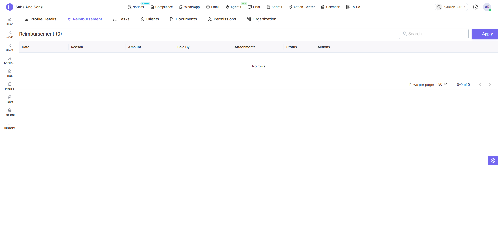

Personal staff conveyance and out-of-pocket claim submissions:
- **Table Columns**: `Date`, `Reason`, `Amount`, `Paid By`, `Attachments`, `Status`, `Actions`.
- **Action**: `+ Apply` button (opens claim submission modal).

---

### 3.3 Tab 3: Assigned Tasks & Re-Assignment

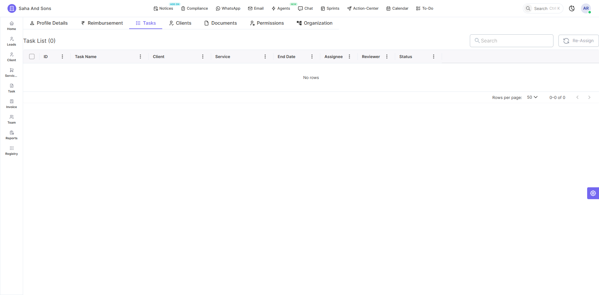

Personal compliance task workbench:
- **Table Columns**: `Checkbox`, `ID`, `Task Name`, `Client`, `Service`, `End Date`, `Assignee`, `Reviewer`, `Status`.
- **Action**: `Re-Assign` button (re-allocates tasks to other associates).

---

### 3.4 Tab 4: Assigned Clients Portfolio

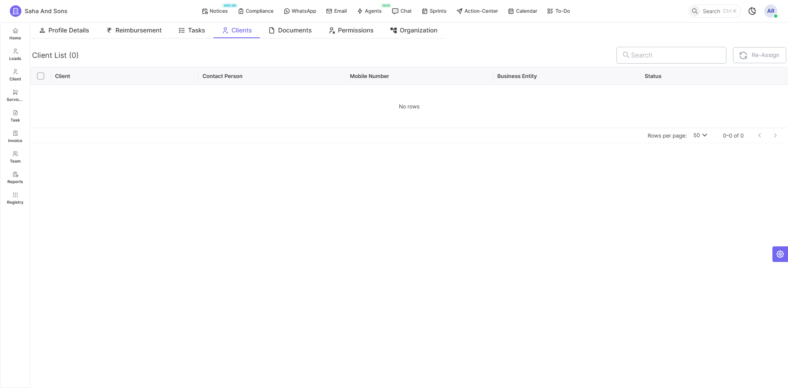

Portfolio of clients managed by this team member:
- **Table Columns**: `Checkbox`, `Client`, `Contact Person`, `Mobile Number`, `Business Entity`, `Status`.
- **Action**: `Re-Assign` button.

---

### 3.5 Tab 5: Employee KYC & Document Vault

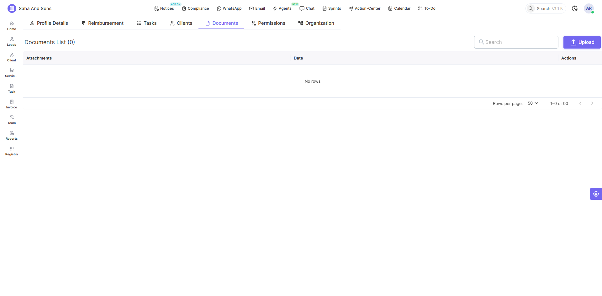

Repository for personal KYC, employment agreements, Form 102/103 articleship registration deeds, Aadhaar, PAN:
- **Table Columns**: `Attachments` (Document link/file), `Date`, `Actions` (View, Download, Delete).
- **Action**: `Upload` button.

---

### 3.6 Tab 6: 30-Module Granular RBAC Permissions Matrix

> 📘 **Full Role & RBAC Specification**: See [role.md](./role.md) for complete role profiles (Managing Partner, Partner, Manager, Senior Associate, Article Trainee, Accountant, Client Portal User), cross-role permissions matrix, and technical defense-in-depth architecture.

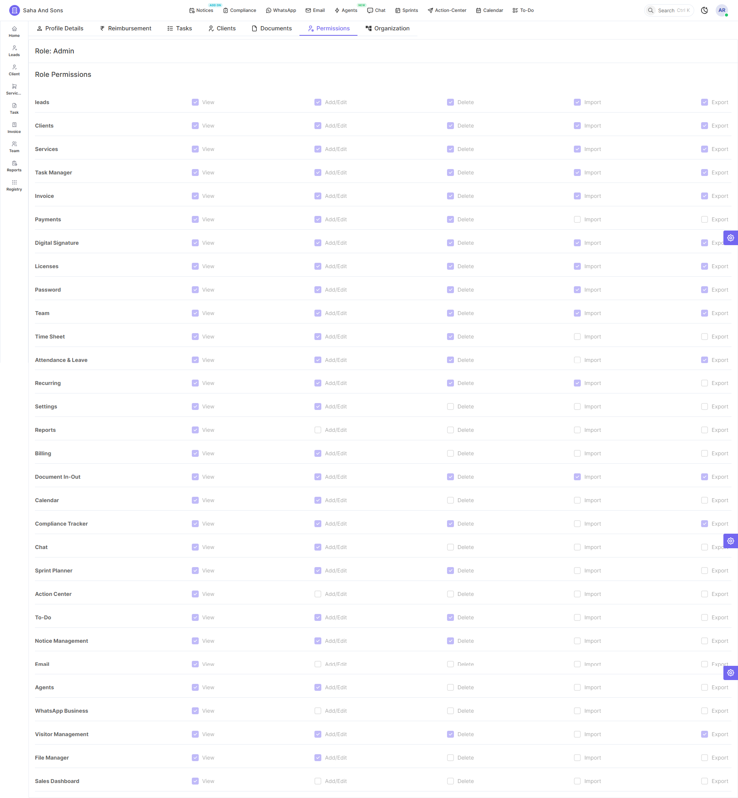

The complete enterprise Role-Based Access Control matrix for `Role: Admin`:

| Module Area | View | Add/Edit | Delete | Import | Export |
|---|:---:|:---:|:---:|:---:|:---:|
| **Leads** | ✅ | ✅ | ✅ | ✅ | ✅ |
| **Clients** | ✅ | ✅ | ✅ | ✅ | ✅ |
| **Services** | ✅ | ✅ | ✅ | ✅ | ✅ |
| **Task Manager** | ✅ | ✅ | ✅ | ✅ | ✅ |
| **Invoice** | ✅ | ✅ | ✅ | ✅ | ✅ |
| **Payments** | ✅ | ✅ | ✅ | ❌ | ❌ |
| **Digital Signature** | ✅ | ✅ | ✅ | ✅ | ✅ |
| **Licenses** | ✅ | ✅ | ✅ | ✅ | ✅ |
| **Password (Credential Vault)** | ✅ | ✅ | ✅ | ✅ | ✅ |
| **Team** | ✅ | ✅ | ✅ | ✅ | ✅ |
| **Time Sheet** | ✅ | ✅ | ✅ | ❌ | ✅ |
| **Attendance & Leave** | ✅ | ✅ | ✅ | ❌ | ✅ |
| **Recurring** | ✅ | ✅ | ✅ | ✅ | ❌ |
| **Settings** | ✅ | ✅ | ❌ | ❌ | ❌ |
| **Reports** | ✅ | ❌ | ❌ | ❌ | ✅ |
| **Billing** | ✅ | ✅ | ❌ | ❌ | ✅ |
| **Document In-Out** | ✅ | ✅ | ✅ | ✅ | ✅ |
| **Calendar** | ✅ | ✅ | ❌ | ❌ | ❌ |
| **Compliance Tracker** | ✅ | ✅ | ✅ | ❌ | ✅ |
| **Chat** | ✅ | ✅ | ❌ | ❌ | ❌ |
| **Sprint Planner** | ✅ | ✅ | ✅ | ❌ | ✅ |
| **Action Center** | ✅ | ❌ | ❌ | ❌ | ❌ |
| **To-Do** | ✅ | ✅ | ✅ | ❌ | ✅ |
| **Notice Management** | ✅ | ✅ | ✅ | ❌ | ✅ |
| **Email** | ✅ | ❌ | ❌ | ❌ | ❌ |
| **Agents (AI Tax OCR)** | ✅ | ✅ | ❌ | ❌ | ✅ |
| **WhatsApp Business** | ✅ | ❌ | ❌ | ❌ | ❌ |
| **Visitor Management** | ✅ | ✅ | ✅ | ❌ | ✅ |
| **File Manager** | ✅ | ✅ | ❌ | ❌ | ✅ |
| **Sales Dashboard** | ✅ | ❌ | ❌ | ❌ | ✅ |

---

### 3.7 Tab 7: Organization Hierarchy Tree Canvas

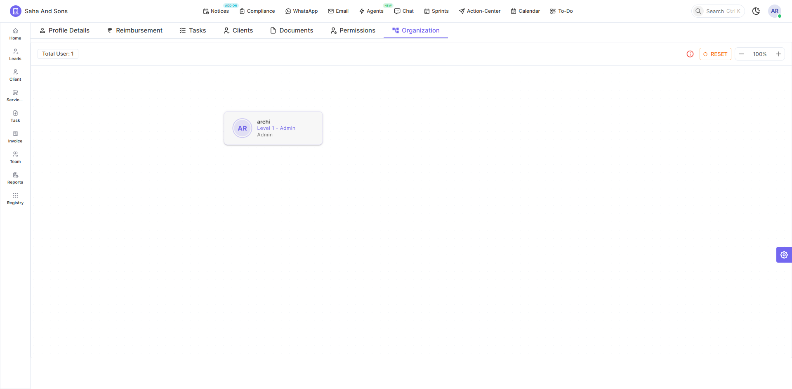

Interactive visual reporting structure:
- **Controls**: `Total User: 1`, `RESET` zoom button, Zoom levels (`— 100% +`).
- **Tree Node Cards**: `AR` Avatar, `archi`, `Level 1 - Admin`, `Admin`, branching into subordinates.

---

## 4. Leads Management & Client Acquisition Engine

The **Leads Module** (`Leads-1.png`, `leads-new.png`, `leads-filter clicked.png`, `leads-3 dots clicked.png`) manages prospective clients, proposals, and pipeline conversions:

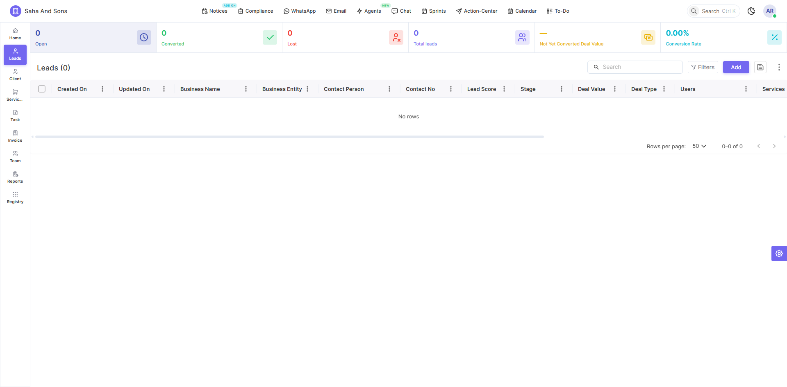

---

### 4.1 Leads KPI Strip & Metrics
- `Open`: `0` count (Purple list icon in light-purple square)
- `Converted`: `0` count (Green check icon in light-green square)
- `Lost`: `0` count (Red x-circle icon in light-red square)
- `Total leads`: `0` count (Blue users icon in light-blue square)
- `Not Yet Converted Deal Value`: `₹0.00` (Amber currency icon in light-amber square)
- `Conversion Rate`: `0.00%` (Cyan percent icon in light-cyan square)

---

### 4.2 Leads Data Table & Column Customization
- **13 Columns**: Checkbox, `Lead Name`, `Business Entity`, `Deal Value`, `Stage`, `Status`, `Score` (Lead scoring 0-100), `Assigned To`, `Source`, `Created Date`, `Phone`, `Email`, `Actions`.
- **Actions**: Edit, Convert to Client, Mark as Lost, Delete.

---

### 4.3 Dynamic Filter Bar & Sliders

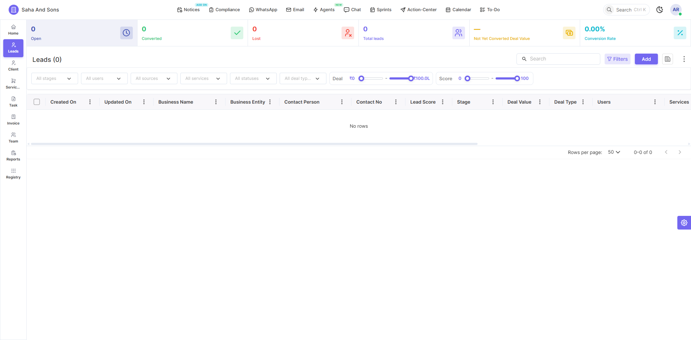

- **6 Dropdown Selectors**: `Stage ⌄`, `Status ⌄`, `Assigned To ⌄`, `Source ⌄`, `Entity Type ⌄`, `Date Range ⌄`.
- **Dual-Thumb Range Sliders**:
  - `Deal Value Range`: Dual slider spanning `₹0` to `₹100,00,000` (₹100 Lakhs).
  - `Lead Score Range`: Dual slider spanning `0` to `100`.
- **Action**: `Apply Filters` (Purple button) & `Clear All`.

---

### 4.4 Add Lead Modal & GSTIN Verification

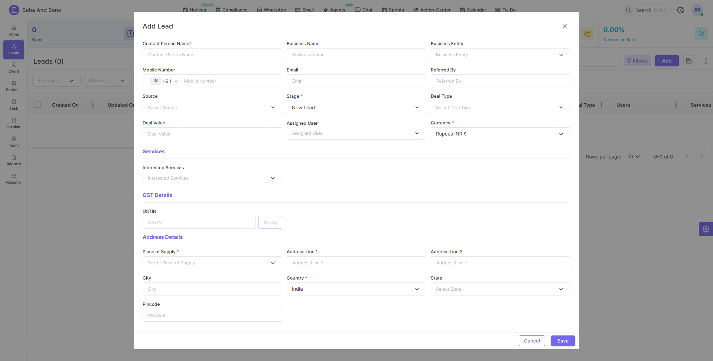

5 Structured Form Sections:
1. **Lead Information**: Lead Name, Contact Person, Email, Mobile (with country code dropdown `IN +91`).
2. **Business Details**: Business Entity (Pvt Ltd, LLP, etc.), PAN Number, GSTIN with **Live Verify Button** (auto-fetches legal name & trade name from GST portal).
3. **Commercials**: Estimated Deal Value, Currency (`INR`), Service Interest (Direct Tax, GST, Audit, ROC).
4. **Acquisition & Pipeline**: Lead Source (Referral, Website, Cold Outreach), Stage (New, Contacted, Proposal Sent, Negotiation), Assigned Associate.
5. **Notes & Address**: City, State, Place of Supply, Remarks.

---

### 4.5 Import / Export & Document Actions

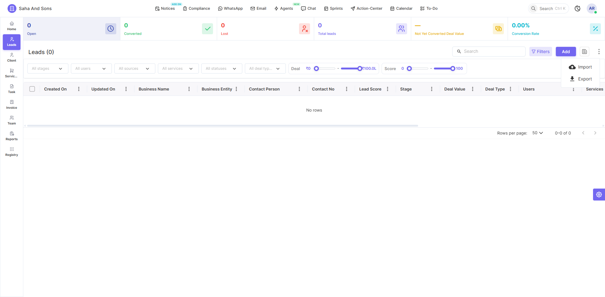

- **Actions Dropdown (`⋮`)**:
  - `Import Leads (CSV / XLSX)`: Opens drag-and-drop batch upload modal.
  - `Export All Leads`: Downloads structured CSV of filtered leads.
  - `Download Sample CSV`: Provides standardized template.

---

## 5. Client Master & Entity Directory

The **Client Module** (`Clients-1.png`, `client-New.png`, `clients-3 dots click.png`, `clients-Import clients.png`, `Clients_03-09-2026.xlsx`) is the foundational repository of all client entities:

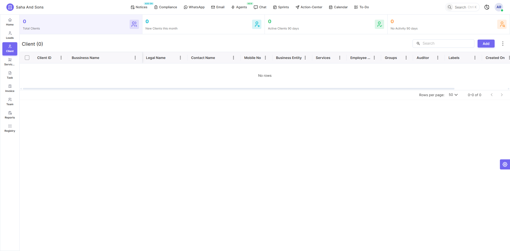

---

### 5.1 Client KPI Strip & Activity Tracking
- `Total Clients`: `0` count (Purple building icon in light-purple square)
- `New Clients this month`: `0` count (Green user-plus icon in light-green square)
- `Active Clients 90 days`: `0` count (Blue activity icon in light-blue square)
- `No Activity 90 days`: `0` count (Orange clock icon in light-orange square - dormant client alert)

---

### 5.2 Client Data Table & Column Specifications
- **13 Columns**: Checkbox, `Client Code`, `Trade Name`, `Legal Name`, `Business Entity`, `PAN`, `Primary GSTIN`, `Assigned Partner`, `Assigned Manager`, `Phone`, `Email`, `Status`, `Actions`.
- **Customization**: Column picker menu to toggle visibility and re-order columns.

---

### 5.3 Add Client Form & GST Verification

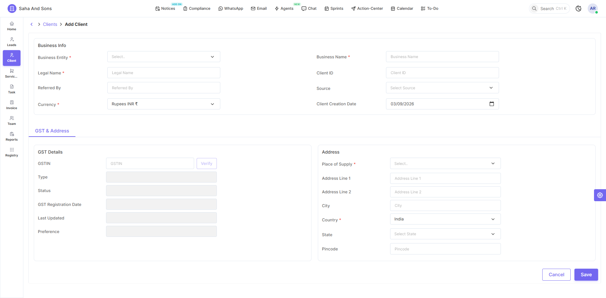

- **Business Info Card**: Legal Business Name, Trade Name, Entity Type, PAN Number, CIN/LLPIN, Financial Year start, Industry sector.
- **GST Details Card**: Primary GSTIN, State / Place of Supply, **Verify GSTIN** button (auto-populates address and filing frequency).
- **Communication & Contacts**: Primary Contact Name, Designation, Phone, Email, Billing Address.
- **Staff Assignment**: Assigned Engagement Partner, Audit Manager, Lead Article Assistant.

---

### 5.4 Import Clients & Downloadable XLSX Sample Specification

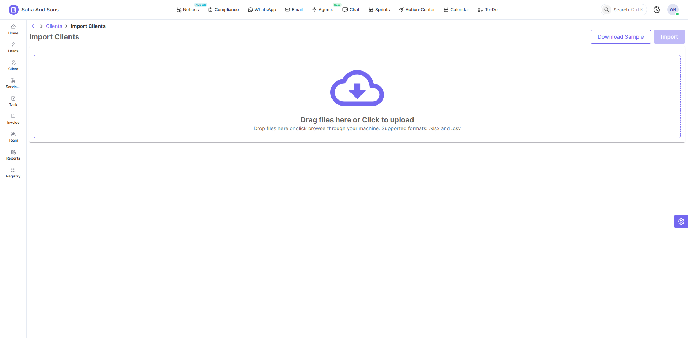

- **Official 24-Column XLSX Sample (`Clients_03-09-2026.xlsx`)**:
  `Client Code` | `Trade Name *` | `Legal Name *` | `Entity Type *` | `PAN *` | `CIN / LLPIN` | `GSTIN` | `State Code` | `Address Line 1` | `Address Line 2` | `City` | `State` | `Pincode` | `Contact Person Name` | `Designation` | `Mobile Number *` | `Email ID *` | `Assigned Partner` | `Assigned Manager` | `Client Group` | `Filing Frequency` | `Billing Currency` | `Opening Balance` | `Status`.

---

### 5.5 Multi-Entity Groups, Contacts & Multi-GSTIN Support
- **Client Groups**: Links sister companies, subsidiaries, and individual promoter files into unified billing and reporting groups.
- **Multi-Branch GSTIN Vault**: Handles clients with multiple state GST registrations under a single PAN.

---

## 6. Services Catalog & Master Repository

The **Services Module** (`services-1.png`, `services-new.png`, `Service_SampleData.xlsx`) defines the firm's master service menu, statutory compliance scheduling rules, pricing schedules, SAC codes, turnaround times (TAT), Standard Operating Procedures (SOPs), and sub-task checklists:

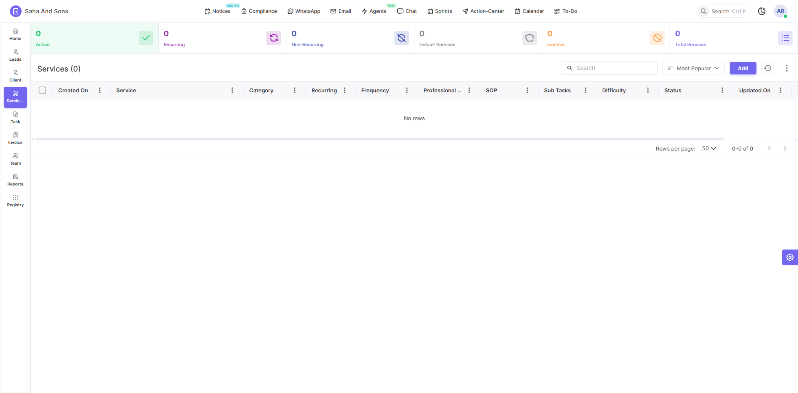

---

### 6.1 Services KPI Strip & Metrics
- `Active`: `0` count (Green check icon in light-green square)
- `Recurring`: `0` count (Purple repeat icon in light-purple square)
- `Non-Recurring`: `0` count (Blue zap icon in light-blue square)
- `Default Services`: `0` count (Cyan star icon in light-cyan square)
- `Inactive`: `0` count (Red ban icon in light-red square)
- `Total Services`: `0` count (Purple layers icon in light-purple square)

---

### 6.2 Services Data Table & Columns
- **12 Columns**: Checkbox, `Service Code`, `Service Name`, `Category` (Direct Tax, GST, Audit, Corporate Law, Accounting), `SAC Code` (e.g. 998231, 998222), `Billing Type` (Fixed, Hourly, Retainer), `Base Fee`, `Estimated Hours`, `TAT (Days)`, `Recurrence Frequency`, `Status`, `Actions`.

---

### 6.3 Add New Service Modal & Commercial Configuration

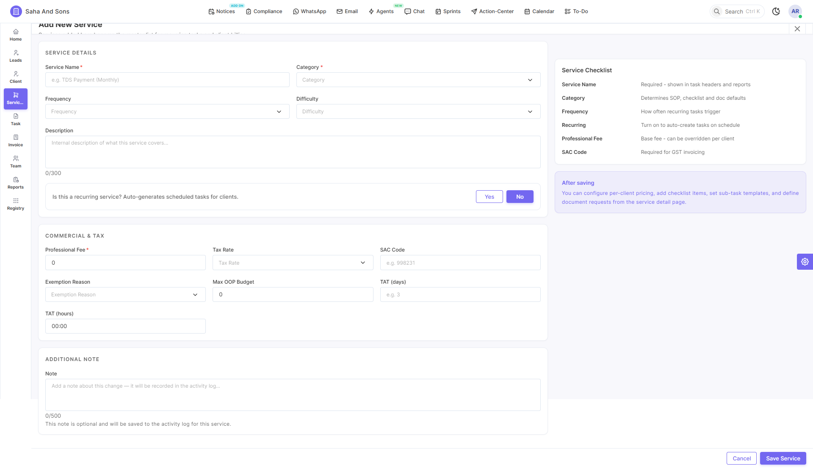

- **Service Details**: Service Name, Category, Difficulty Level (Low, Medium, High, Critical), Default Assignee Role.
- **Commercial & Tax**: SAC Code (9982xx), Default Fee (₹), GST Rate (18%), Estimated Turnaround Time (TAT in Days), Estimated Out-of-Pocket (OOP) expense budget.
- **Recurrence Schedule**: Non-Recurring vs. Recurring (Monthly, Quarterly, Half-Yearly, Annually), Trigger Day of Month, Due Date Offset.

---

### 6.4 Downloadable Service Sample XLSX & Multi-Sheet Structure

The official `Service_SampleData.xlsx` template contains **3 structured sheets**:
1. **`Services` (18 Columns)**: `Service Name *`, `Category *`, `Sub Category`, `Service Code`, `SAC Code *`, `Description`, `Billing Type *`, `Base Rate *`, `GST Rate *`, `Estimated Hours`, `TAT Days *`, `Difficulty`, `Is Recurring (Y/N) *`, `Recurrence Frequency`, `Due Day of Month`, `Default Role`, `SOP URL`, `Status *`.
2. **`Instructions`**: Comprehensive column validation rules and required field guidelines.
3. **`MasterData`**: Controlled dropdown lists for Categories, Billing Types, and Recurrence Frequencies.

---

### 6.5 Sub-Task Templates & Document Checklist Configuration
- Pre-configures step-by-step verification checklists and required document request lists (e.g., Bank Statement, GSTR-2B, Form 26AS, Purchase Register) for each service.

---

## 7. Task & Statutory Compliance Management Engine

The **Task Module** (`task-1.png` to `task-6.png`, `task-2 filter clicked.png`, `task-activity click.png`, `task-add task.png`, `task-heatmap guide.png`) is the central operational engine of the CA firm:

```
┌────────────────────────────────────────────────────────────────────────────────────────────────────────────────────────┐
│ Tabs: [ 📊 Task Summary ] [ 📋 Task List ] [ ✅ Sub Tasks ] [ 🔁 Recurring Schedule ] [ 📈 Analytics ]    [+ Add Task]  │
└────────────────────────────────────────────────────────────────────────────────────────────────────────────────────────┘
```

---

### 7.1 Tab 1: Task Summary Matrix & Logarithmic Heatmap

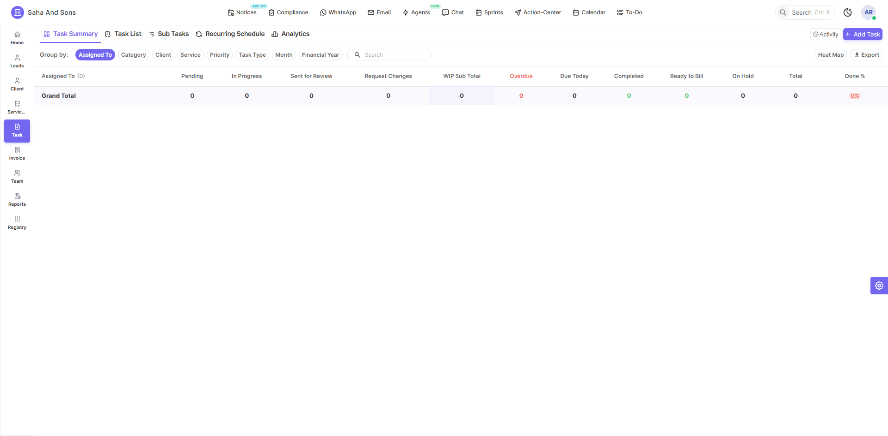

- **8 Grouping Dimensions**: `Status`, `Stage`, `Assignee`, `Client`, `Service`, `Department`, `Priority`, `Due Period`.
- **WIP Subtotal, Overdue & Grand Total Columns**: Aggregates total tasks in progress vs. overdue bottlenecks.
- **Logarithmic Heatmap Legend (`task-heatmap guide.png`)**:
  - `Red / Amber`: Overdue severity (Dark Red = >30d overdue, Amber = 1-15d overdue).
  - `Blue`: Active Work-in-Progress (Intensity reflects volume).
  - `Green`: Completed tasks.

---

### 7.2 Tab 2: Task List & Comprehensive Filter Drawer

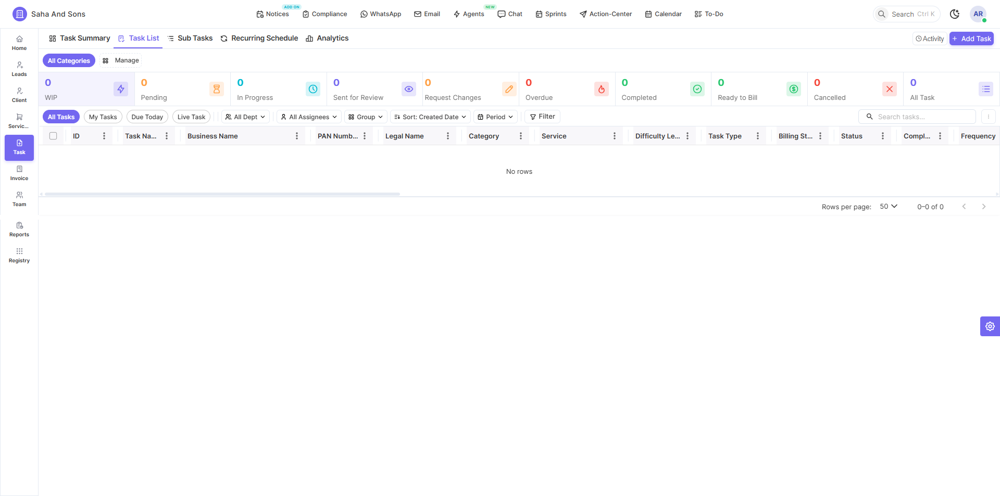

- **10 Status KPI Cards**: `All Tasks`, `Not Started`, `In Progress`, `Under Review`, `Client Review`, `Clarification Needed`, `Waiting for Govt Portal`, `Completed`, `Billed`, `Overdue`.
- **14-Column Task Table**: Checkbox, `Task ID`, `Client Name`, `Service Name`, `Task Title`, `Assigned To`, `Reviewer`, `Priority`, `Stage`, `Start Date`, `Target Date`, `Statutory Due Date`, `Billable Status`, `Actions`.
- **Slide-Over Filter Panel (`task-2 filter clicked.png`)**:
  - Quick Scope Filters: `My Tasks`, `My Review`, `Team Tasks`.
  - Multi-select filters with colored status dots, Priority (Urgent, High, Normal, Low), Assignee, Billable toggle, Department.

---

### 7.3 Tab 3: Sub-Tasks Execution & Verification Pipeline

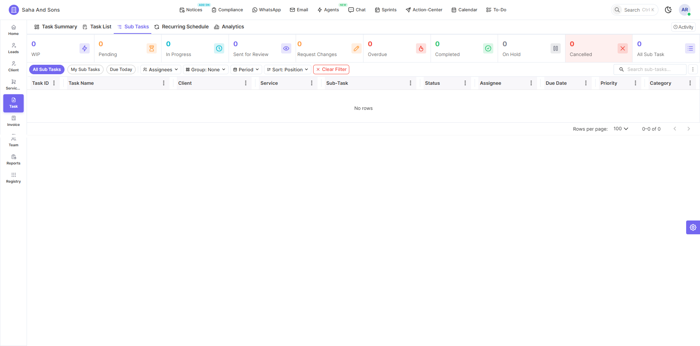

- Granular checklist pipeline for auditing steps and verification checkpoints.
- **10-Column Table**: Checkbox, `Sub-Task ID`, `Parent Task`, `Title`, `Assigned To`, `Reviewer`, `Weightage %`, `Due Date`, `Status`, `Actions`.

---

### 7.4 Tab 4: Recurring Compliance Schedule & FY Calendar

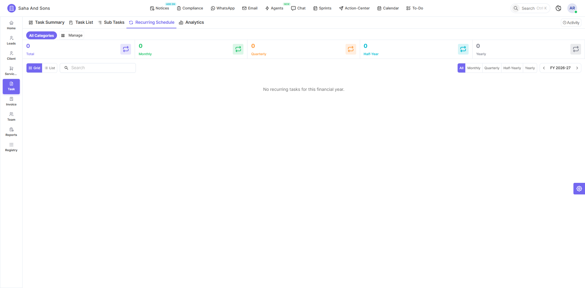

- **5 Recurrence KPI Cards**: `Total Recurring`, `Monthly Schedules`, `Quarterly Schedules`, `Annual Compliance`, `Pending Generation`.
- **FY Calendar Navigator**: Shows scheduled auto-generation dates across the Financial Year (Apr-Mar).

---

### 7.5 Tab 5: Analytics & 12 Management MIS Reports

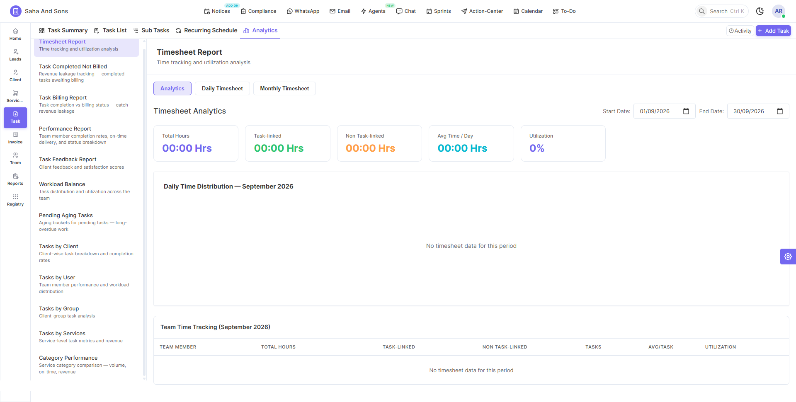

Sidebar navigation across **12 Management Reports**:
1. `Timesheet Report` (`task-5.png`): Daily billable hours trend and associate tracking.
2. `Pending Aging Report` (`task-6.png`): 6 Aging bucket cards (`>60d`, `31-60d`, `15-30d`, `7-14d`, `<7d`, `Total Pending`).
3. `User Productivity Report`
4. `Client Compliance Scorecard`
5. `Turnaround Time (TAT) Analysis`
6. `Statutory Due Date Adherence Rate`
7. `Overdue Bottlenecks by Service`
8. `Review Cycle Velocity`
9. `Task Billing Realization`
10. `Staff Workload Distribution`
11. `Checklist Verification Audit`
12. `Service Profitability Analysis`

---

### 7.6 Add Task Modal & Proforma Invoice Linking

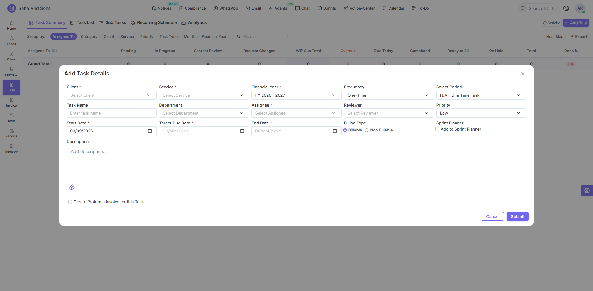

- Client Selector, Service Master selector, Financial Year, Assessment Year, Filing Period.
- Target Start Date, Target Completion Date, Statutory Due Date.
- Assigned Partner, Audit Manager, Lead Article Assistant.
- **1-Click Billing Action**: Checkbox for `Create Proforma Invoice for this Task` (auto-generates draft proforma with service SAC rate upon creation).

---

### 7.7 Slide-Over Task Activity & Audit Trail Drawer

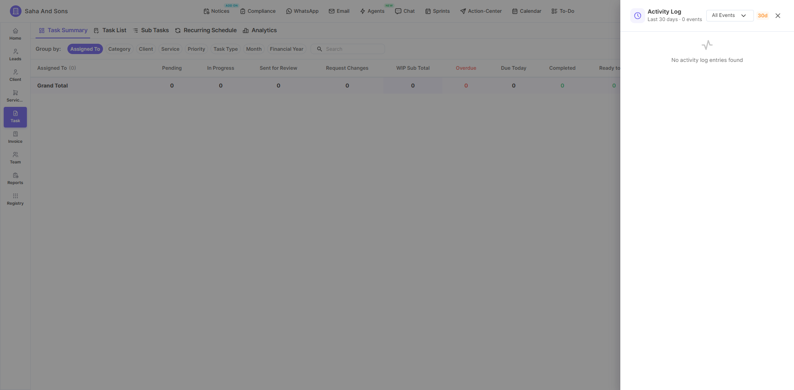

- 30-day immutable activity log tracking every status change, reassignment, note, and client document upload.
- Event filter dropdown (`All Events`, `Status Changes`, `Comments`, `File Uploads`).

---

## 8. Invoice, Billing & Receipts Engine

The **Invoice Module** (`invoice-1.png` to `invoice-7.png`, `invoice-add.png`) governs the firm's financial cashflow, billing lifecycle, pass-through client reimbursements, payment receipts, recurring retainer billing, and GSTR-1 compliance reporting:

```
┌────────────────────────────────────────────────────────────────────────────────────────────────────────────────────────┐
│ Tabs: [ 📄 Proforma Invoice ] [ 🧾 Invoice ] [ 🔁 Reimbursement ] [ 💵 Receipts ] [ 🔄 Recurring Invoice ] [ 📈 Sales Analytics ] │
└────────────────────────────────────────────────────────────────────────────────────────────────────────────────────────┘
```

---

### 8.1 Tab 1: Proforma Invoice Management

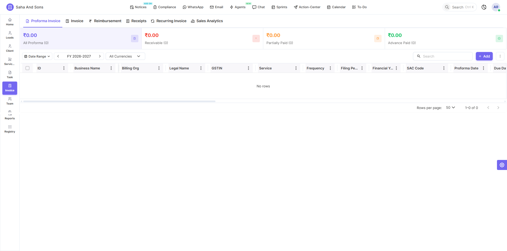

- **4 KPI Cards**: `Draft Proforma`, `Sent to Client`, `Approved`, `Converted to Tax Invoice`.
- **13-Column Proforma Table**: Checkbox, `Proforma Number`, `Date`, `Client Name`, `Services`, `Gross Amount`, `GST (CGST/SGST/IGST)`, `Total Amount`, `Reimbursements`, `Net Total`, `Status`, `Converted Invoice No`, `Actions`.
- **Action**: 1-click **Convert to Tax Invoice** button.

---

### 8.2 Tab 2: Tax Invoice Management

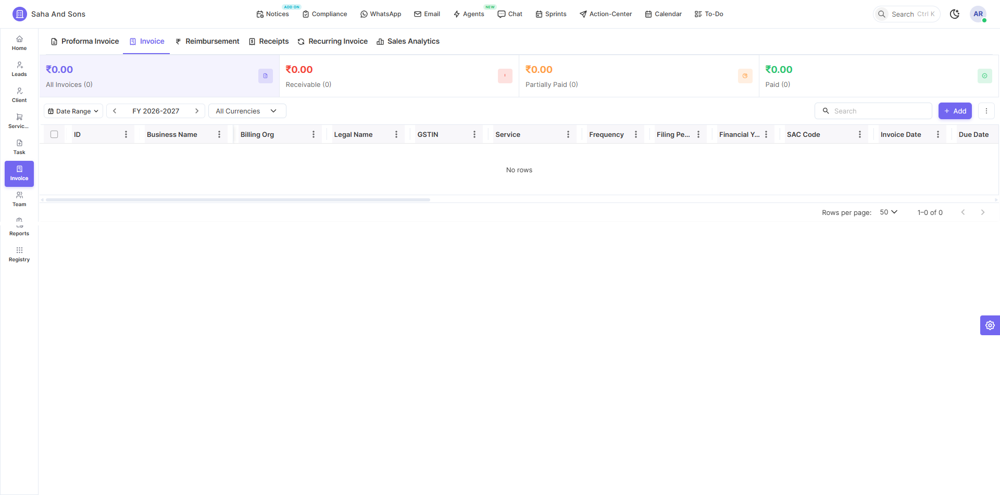

- **4 KPI Cards**: `Total Invoiced`, `Paid Invoices`, `Partially Paid`, `Overdue Invoices`.
- **13-Column Invoice Table**: Checkbox, `Invoice Number`, `Date`, `Due Date`, `Client Name`, `SAC Code`, `Taxable Value`, `Total GST`, `Gross Amount`, `Paid Amount`, `Balance Due`, `Status` (Paid, Unpaid, Overdue), `Actions`.

---

### 8.3 Tab 3: Pass-Through Reimbursements

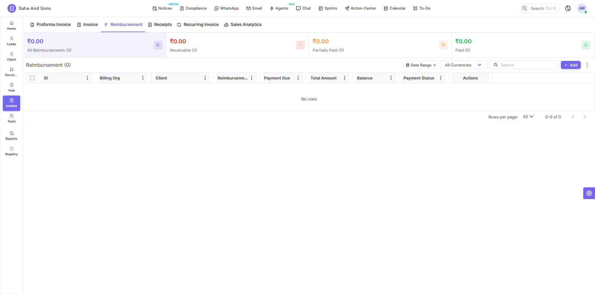

- Tracks client out-of-pocket expenses (ROC challans, court fees, stamp papers, official travel) billed at cost without GST markup:
- **4 KPI Cards**: `Total Incurred`, `Billed to Client`, `Recovered`, `Pending Recovery`.
- **10-Column Table**: Checkbox, `Expense Date`, `Client`, `Reason`, `Category`, `Amount`, `Billable Status`, `Invoice Ref`, `Payment Status`, `Actions`.

---

### 8.4 Tab 4: Payment Receipts & Advance Tracking

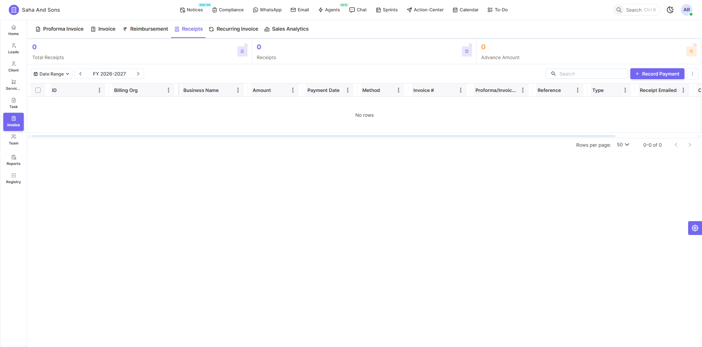

- **3 KPI Cards**: `Total Receipts This Month`, `Advance Receipts`, `Unallocated Funds`.
- **12-Column Table**: Checkbox, `Receipt No`, `Receipt Date`, `Client Name`, `Amount Received`, `Payment Mode` (Bank Transfer, NEFT/RTGS, UPI, Cheque, Cash), `Bank Account`, `UTR / Reference No`, `Allocated Invoices`, `TDS Deducted (194J)`, `Net Inflow`, `Actions`.
- **Action**: `+ Record Payment` modal trigger.

---

### 8.5 Tab 5: Recurring Invoice Engine

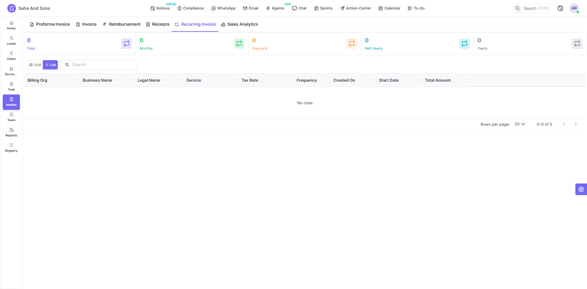

- Retainer billing automation:
- **5 Recurrence Cards**: `Total Retainers`, `Monthly Retainers`, `Quarterly Retainers`, `Annual Retainers`, `Auto-Generate Status`.
- Grid / List view toggle for active retainers.

---

### 8.6 Tab 6: Sales Analytics & GSTR-1 Outward Supplies Report

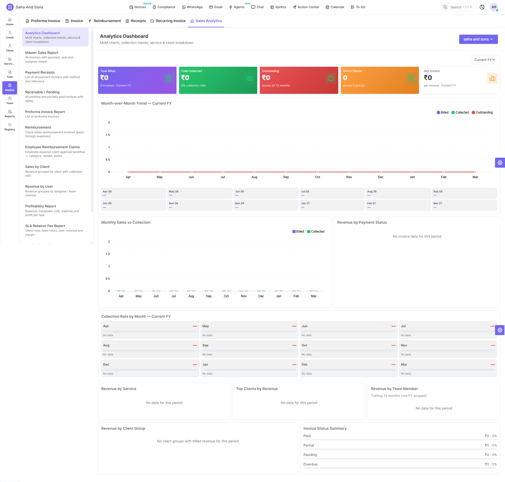
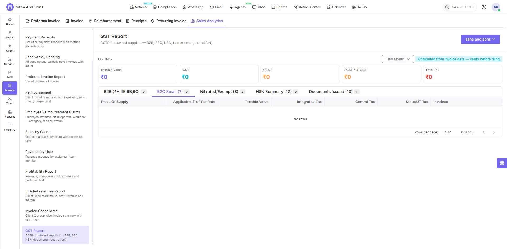

- **13 Analytics Reports Sidebar**: Monthly sales trends, realization rates, collection efficiency.
- **GSTR-1 Outward Supplies Report (`invoice-7.png`)**:
  - `5 Tax Stat Cards`: Total Outward Taxable Supplies, Total CGST, Total SGST, Total IGST, Total Tax Inflows.
  - `GSTR-1 Sections`:
    - **Table 4: B2B Invoices** (Supplies to registered GSTIN entities).
    - **Table 7: B2C Small Supplies** (Supplies to unregistered entities).
    - **Table 8: Nil Rated / Exempted Supplies**.
    - **Table 12: HSN / SAC Summary** (SAC 9982xx legal and accounting services).

---

### 8.7 Add Proforma / Tax Invoice Screen

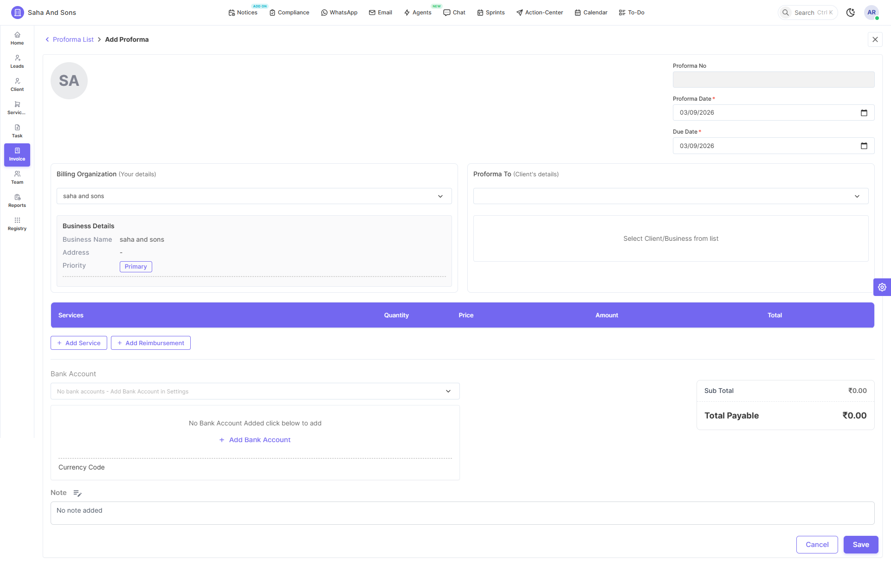

- **Billing Organization**: Select firm entity & bank payment instructions.
- **Client Selection**: Client legal name, billing address, GSTIN, Place of Supply.
- **Line Items Table**:
  - Section A: Professional Services (Service, SAC Code, Rate, Qty, Disc, Taxable Value, GST Rate 18%).
  - Section B: Pass-Through Reimbursements (Expense reason, amount - zero GST).
- **Summary Calculations**: Subtotal, CGST (9%), SGST (9%), IGST (18%), Round Off, Grand Total.
- **Bank Payment Instructions**: Select firm bank account to print bank IFSC, Account Number, and UPI QR code on invoice PDF.

---

## 9. Team & Staff Management Module

The **Team Module** (`team-1.png` to `team-4.png`, `team-add user.png`) handles human resources, CA partner & employee hierarchy, paid assistants, article trainees, geofenced GPS attendance with regularization, study leave pipelines, internal employee reimbursement claims, and license seat allocations:

```
┌────────────────────────────────────────────────────────────────────────────────────────────────────────────────────────┐
│ Tabs: [ 👥 Team ] [ ⏱ Attendance ] [ 📝 Leave ] [ 🔁 Reimbursement ]                                    [+ Add Users]  │
└────────────────────────────────────────────────────────────────────────────────────────────────────────────────────────┘
```

---

### 9.1 Tab 1: Team Directory & License Seat Tracker

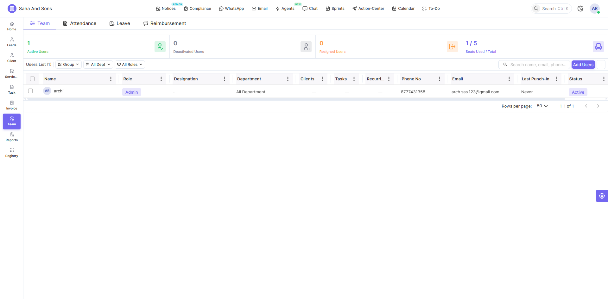

- **4 Metric KPI Cards**:
  1. `Active Users`: `1` (Green text + user-check icon)
  2. `Deactivated Users`: `0` (Slate text + user-off icon)
  3. `Resigned Users`: `0` (Orange text + exit/arrow icon)
  4. **`Seats Used / Total`**: **`1 / 5`** (Blue text + armchair icon — tracks subscription capacity)
- **11-Column Users Table**: Checkbox, `Name` (Avatar + name: `AR` archi), `Role` (`Admin` badge), `Designation`, `Department`, `Clients`, `Tasks`, `Recurring`, `Phone No`, `Email`, `Last Punch-In`, `Status`.
- **Filters**: `Group ⌄`, `All Dept ⌄`, `All Roles ⌄`, Search, `Add Users` button.

---

### 9.2 Tab 2: Attendance & Geofenced Clock-In Tracking

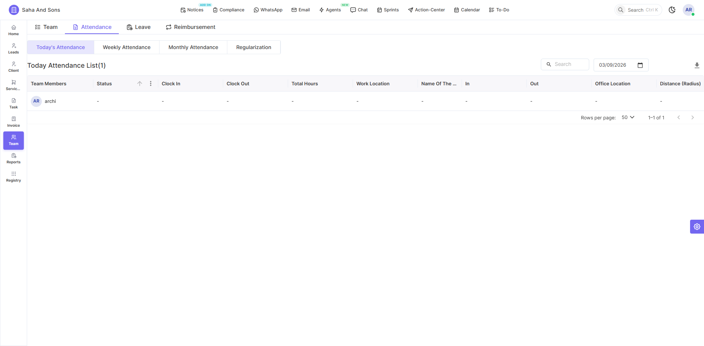

- **4 View Modes**: `Today's Attendance`, `Weekly Attendance`, `Monthly Attendance`, `Regularization`.
- **11-Column Attendance Table**: `Team Members`, `Status`, `Clock In`, `Clock Out`, `Total Hours`, `Work Location` (Office / Remote / Client Site), `Name Of The Client`, `In` (Punch In Geo/IP), `Out` (Punch Out Geo/IP), `Office Location`, `Distance (Radius)` (Geofenced GPS distance in meters from firm office).
- **Controls**: Date Picker (`03/09/2026`), Search, Export icon.

---

### 9.3 Tab 3: Leave Management & CA Exam Study Leave Pipeline

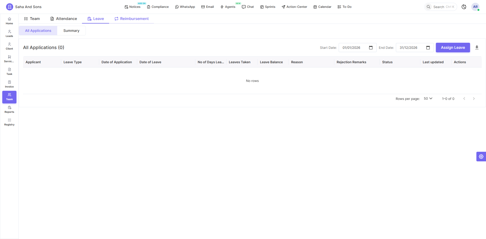

- **2 View Modes**: `All Applications` (active) and `Summary` (leave entitlement & balance ledger).
- **11-Column Applications Table**: `Applicant`, `Leave Type` (Casual Leave, Sick Leave, CA Exam Study Leave, Earned Leave), `Date of Application`, `Date of Leave`, `No of Days Leave`, `Leaves Taken`, `Leave Balance`, `Reason`, `Rejection Remarks`, `Status` (Approved / Pending / Rejected), `Last updated`, `Actions` (Approve / Reject triggers).
- **Controls**: Date Range filter (`01/01/2026` to `31/12/2026`), `Assign Leave` button, Export.

---

### 9.4 Tab 4: Employee Expense Reimbursement Claims

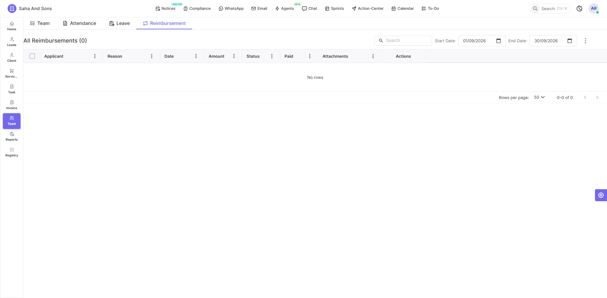

- Internal staff expense reimbursement system for audit travel, MCA stamp papers, court conveyance:
- **8-Column Claims Table**: Checkbox, `Applicant`, `Reason`, `Date`, `Amount`, `Status` (Approved / Pending / Rejected), `Paid` (Settled / Unsettled), `Attachments` (Receipt PDF/Image link), `Actions` (Approve / Settle / Reject).

---

### 9.5 Add Employee 4-Step Stepper Wizard

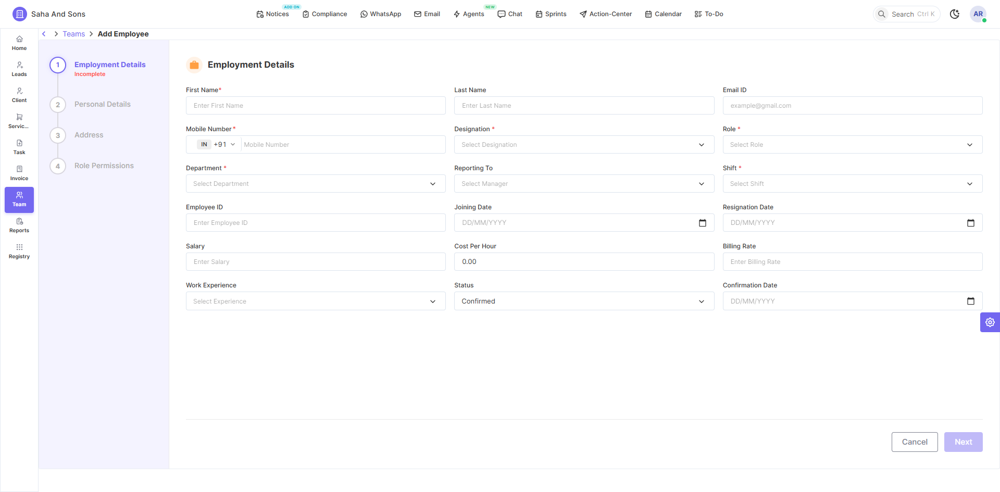

Clicking **Add Users** opens `< > Teams > Add Employee`:
- **Step 1: Employment Details**:
  - `First Name *`, `Last Name`, `Email ID`
  - `Mobile Number *` (`IN +91`), `Designation *` (Partner, Manager, Senior Associate, Article Trainee), `Role *` (Admin, Manager, Staff)
  - `Department *` (Direct Tax, GST, Audit, ROC, Accounting, Admin), `Reporting To` (Manager hierarchy), `Shift *` (General Shift)
  - `Employee ID`, `Joining Date`, `Resignation Date`
  - `Salary`, `Cost Per Hour` (Internal hourly labor cost), `Billing Rate` (Client billable rate used in timesheet costing & profitability)
  - `Work Experience`, `Status` (`Confirmed`, `Probation`, `Notice Period`, `Intern`), `Confirmation Date`
- **Step 2: Personal Details**: DOB, Gender, Blood Group, PAN, Aadhaar, Emergency Contact, ICAI Membership No / Student Registration No (for articles).
- **Step 3: Address**: Current & Permanent Address, City, State, Country (`India`), Pin Code.
- **Step 4: Role Permissions**: Fine-grained RBAC permission matrix for Clients, Tasks, Invoices, Team, Reports, and Registry.

---

## 10. Reports & Executive MIS Analytics Hub

The **Reports Module** (`reports-1.png`) is the executive management dashboard providing high-level business intelligence across 6 structured practice categories in a 3x2 grid:

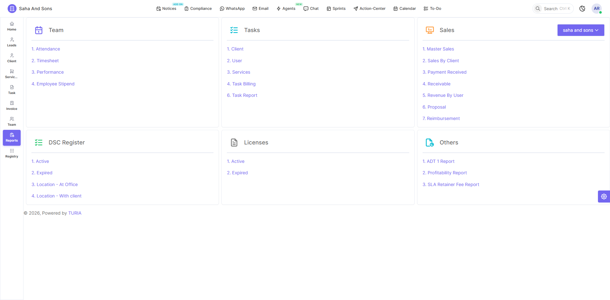

```
┌──────────────────────────────────────┬──────────────────────────────────────┬──────────────────────────────────────┐
│ 📅 Team                              │ 📋 Tasks                             │ 🖥️ Sales         [saha and sons ⌄]   │
│ 1. Attendance                        │ 1. Client                            │ 1. Master Sales                      │
│ 2. Timesheet                         │ 2. User                              │ 2. Sales By Client                   │
│ 3. Performance                       │ 3. Services                          │ 3. Payment Received                  │
│ 4. Employee Stipend                  │ 4. Task Billing                      │ 4. Receivable                        │
│                                      │ 6. Task Report                       │ 5. Revenue By User                   │
│                                      │                                      │ 6. Proposal                          │
│                                      │                                      │ 7. Reimbursement                     │
├──────────────────────────────────────┼──────────────────────────────────────┼──────────────────────────────────────┤
│ 📋 DSC Register                      │ 📄 Licenses                          │ ⏱️ Others                            │
│ 1. Active                            │ 1. Active                            │ 1. ADT 1 Report                      │
│ 2. Expired                           │ 2. Expired                           │ 2. Profitability Report              │
│ 3. Location - At Office              │                                      │ 3. SLA Retainer Fee Report           │
│ 4. Location - With client            │                                      │                                      │
└──────────────────────────────────────┴──────────────────────────────────────┴──────────────────────────────────────┘
```

---

### 10.1 6-Category Executive MIS Grid
Executive cards linking directly to deep analytical data views across the entire practice.

---

### 10.2 Team MIS & Article Trainee Stipend Reports
- `Attendance`: Firm-wide punctuality, late clock-ins, leave absenteeism.
- `Timesheet`: Billable vs. non-billable staff utilization.
- `Performance`: Task completion velocities and turnaround times.
- **`Employee Stipend`**: Article assistant stipend computation based on ICAI minimum stipend regulations (City category / 1st, 2nd, 3rd year articleship).

---

### 10.3 Task & Workflow MIS Reports
- `Client`: Client-wise task distribution and pending bottlenecks.
- `User`: Associate workload allocation.
- `Services`: Service-line volume (Direct Tax vs GST vs Audit).
- `Task Billing`: Tasks completed but unbilled (revenue leakage).
- `Task Report`: Master compliance audit report.

---

### 10.4 Sales & Billing MIS Reports
- `Master Sales`: Total billing across all entities.
- `Sales By Client`: Client revenue ranking.
- `Payment Received`: Collection register.
- `Receivable`: Aging buckets (0-30, 31-60, 61-90, 90+ days).
- `Revenue By User`: Partner / Manager fee realization.
- `Proposal`: Leads conversion and proposal pipeline.
- `Reimbursement`: Recovered vs. pending client pass-through expenses.

---

### 10.5 Statutory Form ADT-1 & Profitability Reports
- **`ADT 1 Report`**: Auditor Appointment statutory tracker under Section 139 of the Companies Act 2013, tracking Form ADT-1 SRN numbers, appointment dates, and 5-year tenure expiration.
- **`Profitability Report`**: Service & client net margin after factoring in staff `cost_per_hour` and direct expenses.
- **`SLA Retainer Fee Report`**: Retainership fee margins vs. actual hours spent.

---

## 11. Statutory Registry Module & DSC Physical Vault

The **Registry Module** (`registry-dsc.png`) is the firm's physical and digital vault for managing **Digital Signature Certificates (DSC)** (Class 3 cryptographic USB tokens like ePass2003, ProxKey, Watchdata) used for filing MCA ROC forms, Income Tax returns, and GST submissions on behalf of client directors:

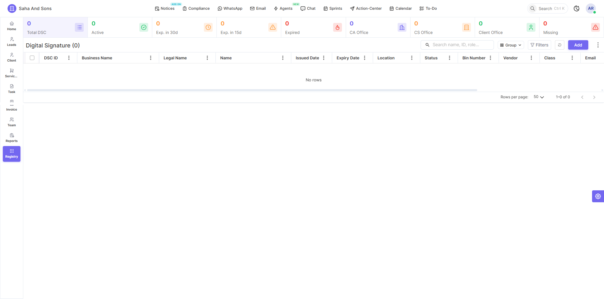

---

### 11.1 DSC Physical Vault & Signatory Register
- **12-Column DSC Table**:
  `Checkbox` | `DSC ID` (`DSC-1001`) | `Business Name` | `Legal Name` | `Name` (Signatory / Director name) | `Issued Date` | `Expiry Date` | `Location` (`CA Office`, `CS Office`, `Client Office`, `Missing`) | `Status` (`Active`, `Expired`, `Revoked`) | `Bin Number` (Vault storage drawer e.g. `BIN-A12`) | `Vendor` (eMudhra, Capricorn, VSign, Pantasign) | `Class` (`Class 3`) | `Email`.
- **Controls**: Search, `Group ⌄`, `Filters` button, Audit log icon, `Add` button (purple primary).

---

### 11.2 DSC Expiry Warning Pipeline (30d & 15d)
- Top KPI alerts: `Exp. in 30d` and `Exp. in 15d` automatically flag upcoming certificate expirations so the firm can initiate KYC renewal with the certifying authority before tax filing deadlines.

---

### 11.3 Token Location & Bin Vault Management
- Physical USB token custody tracking:
  - `CA Office`: Physically located in firm custody inside a designated bin drawer (e.g. `BIN-A12`).
  - `CS Office`: In possession of partner Company Secretary.
  - `Client Office`: In possession of client director.
  - `Missing`: Untraceable alert requiring physical verification.

---

### 11.4 Client Licenses & Statutory Registrations
- Tracks statutory licenses: FSSAI Food Licenses, Import Export Code (IEC), Trade Licenses, Shop & Establishment Registrations, Pollution Control Board (PCB) clearances, with automated renewal reminder countdowns.

---

## 12. Database Schemas & TypeScript Mock Data Models

### 12.1 Supabase PostgreSQL DDL (`schema.sql`)

```sql
-- Enable necessary extensions
CREATE EXTENSION IF NOT EXISTS "uuid-ossp";

-- 1. FIRMS / ORGANIZATIONS
CREATE TABLE IF NOT EXISTS firms (
  id UUID PRIMARY KEY DEFAULT uuid_generate_v4(),
  business_name VARCHAR(255) NOT NULL,
  brand_name VARCHAR(255),
  business_email VARCHAR(255) NOT NULL,
  contact_number VARCHAR(50) NOT NULL,
  currency VARCHAR(10) DEFAULT 'INR',
  total_license_seats INTEGER DEFAULT 5,
  business_entity VARCHAR(100) DEFAULT 'Partnership Firm',
  business_type VARCHAR(100) DEFAULT 'CA Firm',
  address_line_1 TEXT NOT NULL,
  address_line_2 TEXT,
  city VARCHAR(100) NOT NULL,
  state VARCHAR(100) NOT NULL,
  country VARCHAR(100) DEFAULT 'India',
  pin_code VARCHAR(20),
  is_gst_registered BOOLEAN DEFAULT FALSE,
  gstin VARCHAR(15),
  pan_number VARCHAR(10),
  tan_number VARCHAR(10),
  onboarding_step INTEGER DEFAULT 1,
  onboarding_completed BOOLEAN DEFAULT FALSE,
  created_at TIMESTAMPTZ DEFAULT NOW(),
  updated_at TIMESTAMPTZ DEFAULT NOW()
);

-- 2. USERS & STAFF DIRECTORY
CREATE TYPE user_role AS ENUM ('admin', 'partner', 'manager', 'senior_associate', 'article_trainee', 'staff', 'client');
CREATE TYPE employment_status_enum AS ENUM ('confirmed', 'probation', 'notice_period', 'intern', 'resigned', 'deactivated');

CREATE TABLE IF NOT EXISTS firm_users (
  id UUID PRIMARY KEY DEFAULT uuid_generate_v4(),
  firm_id UUID REFERENCES firms(id) ON DELETE CASCADE,
  auth_user_id VARCHAR(255) UNIQUE,
  employee_id VARCHAR(50),
  first_name VARCHAR(100) NOT NULL,
  last_name VARCHAR(100),
  full_name VARCHAR(255) NOT NULL,
  email VARCHAR(255) NOT NULL,
  phone VARCHAR(50),
  role user_role DEFAULT 'article_trainee',
  designation VARCHAR(100),
  department VARCHAR(100) DEFAULT 'Direct Tax',
  reporting_to_id UUID REFERENCES firm_users(id),
  shift VARCHAR(100) DEFAULT 'General Shift (10:00 AM - 07:00 PM)',
  joining_date DATE,
  resignation_date DATE,
  confirmation_date DATE,
  salary NUMERIC(12, 2) DEFAULT 0.00,
  cost_per_hour NUMERIC(10, 2) DEFAULT 0.00,
  billing_rate NUMERIC(10, 2) DEFAULT 0.00,
  work_experience VARCHAR(50),
  employment_status employment_status_enum DEFAULT 'confirmed',
  dob DATE,
  gender VARCHAR(20),
  pan_number VARCHAR(10),
  aadhaar_number VARCHAR(12),
  icai_member_number VARCHAR(50),
  icai_student_number VARCHAR(50),
  avatar_url TEXT,
  address_line_1 TEXT,
  city VARCHAR(100),
  state VARCHAR(100),
  pin_code VARCHAR(20),
  permissions_json JSONB DEFAULT '{}'::jsonb,
  is_active BOOLEAN DEFAULT TRUE,
  last_punch_in TIMESTAMPTZ,
  created_at TIMESTAMPTZ DEFAULT NOW(),
  updated_at TIMESTAMPTZ DEFAULT NOW()
);

-- 3. EMPLOYEE DOCUMENTS VAULT
CREATE TABLE IF NOT EXISTS user_documents (
  id UUID PRIMARY KEY DEFAULT uuid_generate_v4(),
  firm_id UUID REFERENCES firms(id) ON DELETE CASCADE,
  user_id UUID REFERENCES firm_users(id) ON DELETE CASCADE,
  document_name VARCHAR(255) NOT NULL,
  file_url TEXT NOT NULL,
  file_size_bytes INTEGER,
  created_at TIMESTAMPTZ DEFAULT NOW()
);

-- 4. CLIENT MASTER
CREATE TABLE IF NOT EXISTS clients (
  id UUID PRIMARY KEY DEFAULT uuid_generate_v4(),
  firm_id UUID REFERENCES firms(id) ON DELETE CASCADE,
  client_code VARCHAR(50),
  trade_name VARCHAR(255) NOT NULL,
  legal_name VARCHAR(255) NOT NULL,
  entity_type VARCHAR(100) NOT NULL,
  pan_number VARCHAR(10),
  cin_number VARCHAR(21),
  primary_email VARCHAR(255),
  primary_phone VARCHAR(50),
  status VARCHAR(50) DEFAULT 'active',
  created_at TIMESTAMPTZ DEFAULT NOW(),
  updated_at TIMESTAMPTZ DEFAULT NOW()
);

-- 5. SERVICES MASTER
CREATE TABLE IF NOT EXISTS services_master (
  id UUID PRIMARY KEY DEFAULT uuid_generate_v4(),
  firm_id UUID REFERENCES firms(id) ON DELETE CASCADE,
  service_name VARCHAR(255) NOT NULL,
  service_code VARCHAR(50),
  category VARCHAR(100) NOT NULL,
  sac_code VARCHAR(20) DEFAULT '998231',
  billing_type VARCHAR(50) DEFAULT 'fixed',
  base_fee NUMERIC(12, 2) DEFAULT 0.00,
  gst_rate NUMERIC(5, 2) DEFAULT 18.00,
  estimated_hours NUMERIC(5, 2) DEFAULT 0.00,
  tat_days INTEGER DEFAULT 7,
  is_recurring BOOLEAN DEFAULT FALSE,
  recurrence_frequency VARCHAR(50),
  is_active BOOLEAN DEFAULT TRUE,
  created_at TIMESTAMPTZ DEFAULT NOW()
);

-- 6. COMPLIANCE TASKS
CREATE TABLE IF NOT EXISTS compliance_tasks (
  id UUID PRIMARY KEY DEFAULT uuid_generate_v4(),
  firm_id UUID REFERENCES firms(id) ON DELETE CASCADE,
  client_id UUID REFERENCES clients(id) ON DELETE CASCADE,
  service_id UUID REFERENCES services_master(id),
  task_title VARCHAR(255) NOT NULL,
  financial_year VARCHAR(20) NOT NULL,
  period VARCHAR(50),
  start_date DATE,
  target_date DATE NOT NULL,
  due_date DATE NOT NULL,
  assigned_to_id UUID REFERENCES firm_users(id),
  reviewer_id UUID REFERENCES firm_users(id),
  priority VARCHAR(50) DEFAULT 'normal',
  stage VARCHAR(50) DEFAULT 'not_started',
  is_billable BOOLEAN DEFAULT TRUE,
  created_at TIMESTAMPTZ DEFAULT NOW()
);

-- 7. INVOICES (PROFORMA & TAX)
CREATE TYPE invoice_type_enum AS ENUM ('proforma', 'tax_invoice');

CREATE TABLE IF NOT EXISTS invoices (
  id UUID PRIMARY KEY DEFAULT uuid_generate_v4(),
  firm_id UUID REFERENCES firms(id) ON DELETE CASCADE,
  client_id UUID REFERENCES clients(id) ON DELETE CASCADE,
  invoice_type invoice_type_enum DEFAULT 'tax_invoice',
  invoice_number VARCHAR(100) NOT NULL,
  invoice_date DATE NOT NULL,
  due_date DATE NOT NULL,
  subtotal NUMERIC(12, 2) DEFAULT 0.00,
  cgst_amount NUMERIC(12, 2) DEFAULT 0.00,
  sgst_amount NUMERIC(12, 2) DEFAULT 0.00,
  igst_amount NUMERIC(12, 2) DEFAULT 0.00,
  total_amount NUMERIC(12, 2) DEFAULT 0.00,
  paid_amount NUMERIC(12, 2) DEFAULT 0.00,
  balance_due NUMERIC(12, 2) DEFAULT 0.00,
  status VARCHAR(50) DEFAULT 'unpaid',
  created_at TIMESTAMPTZ DEFAULT NOW()
);

-- 8. DIGITAL SIGNATURE CERTIFICATES (DSC REGISTER)
CREATE TYPE dsc_location_enum AS ENUM ('ca_office', 'cs_office', 'client_office', 'in_transit', 'missing');
CREATE TYPE dsc_status_enum AS ENUM ('active', 'expired', 'revoked');
CREATE TYPE dsc_class_enum AS ENUM ('class_2', 'class_3');

CREATE TABLE IF NOT EXISTS dsc_register (
  id UUID PRIMARY KEY DEFAULT uuid_generate_v4(),
  firm_id UUID REFERENCES firms(id) ON DELETE CASCADE,
  client_id UUID REFERENCES clients(id) ON DELETE CASCADE,
  dsc_code VARCHAR(50) NOT NULL,
  signatory_name VARCHAR(255) NOT NULL,
  pan_number VARCHAR(10),
  din_number VARCHAR(8),
  vendor VARCHAR(100) DEFAULT 'eMudhra',
  dsc_class dsc_class_enum DEFAULT 'class_3',
  issued_date DATE NOT NULL,
  expiry_date DATE NOT NULL,
  location dsc_location_enum DEFAULT 'ca_office',
  bin_number VARCHAR(50),
  status dsc_status_enum DEFAULT 'active',
  email VARCHAR(255),
  phone VARCHAR(50),
  token_pin_encrypted TEXT,
  created_at TIMESTAMPTZ DEFAULT NOW(),
  updated_at TIMESTAMPTZ DEFAULT NOW()
);

-- 9. STATUTORY AUDITOR APPOINTMENTS (FORM ADT-1)
CREATE TABLE IF NOT EXISTS auditor_appointments_adt1 (
  id UUID PRIMARY KEY DEFAULT uuid_generate_v4(),
  firm_id UUID REFERENCES firms(id) ON DELETE CASCADE,
  client_id UUID REFERENCES clients(id) ON DELETE CASCADE,
  financial_year VARCHAR(20) NOT NULL,
  agm_date DATE NOT NULL,
  appointment_date DATE NOT NULL,
  tenure_years INTEGER DEFAULT 5,
  expiry_financial_year VARCHAR(20) NOT NULL,
  roc_srn_number VARCHAR(50),
  filing_date DATE,
  status VARCHAR(50) DEFAULT 'active',
  created_at TIMESTAMPTZ DEFAULT NOW()
);
```

---

### 12.2 TypeScript Types & Mock Data Fixtures (`types.ts`)

```typescript
// ==========================================
// 1. DATA MODELS & ENUMS
// ==========================================
export type UserRole = 'admin' | 'partner' | 'manager' | 'senior_associate' | 'article_trainee' | 'staff';
export type DSCLocation = 'CA Office' | 'CS Office' | 'Client Office' | 'In Transit' | 'Missing';
export type DSCStatus = 'Active' | 'Expired' | 'Revoked';

export interface DSCRecord {
  id: string;
  dscId: string;
  businessName: string;
  legalName: string;
  signatoryName: string;
  issuedDate: string;
  expiryDate: string;
  location: DSCLocation;
  status: DSCStatus;
  binNumber: string;
  vendor: string;
  dscClass: 'Class 3' | 'Class 2';
  email: string;
}

export interface EmployeeRecord {
  id: string;
  employeeId?: string;
  name: string;
  avatarInitials: string;
  role: UserRole;
  designation: string;
  department: string;
  assignedClientsCount: number;
  assignedTasksCount: number;
  recurringTasksCount: number;
  phoneNo: string;
  email: string;
  lastPunchIn: string;
  status: 'active' | 'inactive' | 'resigned';
  billingRate: number;
  costPerHour: number;
}
```

---

## 13. UI / UX Design System & Layout Tokens

- **Brand Primary Accent**: `#6366F1` (Indigo / Purple) for `+ Add`, `Apply for Leave`, `Upload`, and active tabs.
- **Success / Present**: `#10B981` (Emerald Green) for `Present` attendance and active status.
- **Danger / Absent**: `#EF4444` (Crimson Red) for `Absent` days, `Overdue` tasks, and expired records.
- **Warning / Alert**: `#F59E0B` (Amber) for `Week-off`, `Exp. in 30d`, and pending reviews.

---

## 14. Screenshot Reference Catalog

| Screenshot File | Screen / Feature Name | Section Link | Key Visual Elements |
|---|---|---|---|
| [`profile-1.png`](../contextImg/profile-1.png) | **Profile Details & Attendance View** | [Section 3.1](#31-tab-1-profile-details--monthly-attendance-calendar) | Full employee bio, monthly attendance calendar, leave summary, holidays. |
| [`profile-2.png`](../contextImg/profile-2.png) | **Personal Reimbursement View** | [Section 3.2](#32-tab-2-personal-reimbursement-claims) | Staff expense claims with + Apply button. |
| [`profile-3.png`](../contextImg/profile-3.png) | **Assigned Tasks View** | [Section 3.3](#33-tab-3-assigned-tasks--re-assignment) | Assigned task table with Re-Assign button. |
| [`profile-4.png`](../contextImg/profile-4.png) | **Assigned Clients View** | [Section 3.4](#34-tab-4-assigned-clients-portfolio) | Client portfolio table with Re-Assign button. |
| [`profile-5.png`](../contextImg/profile-5.png) | **Employee Document Vault** | [Section 3.5](#35-tab-5-employee-kyc--document-vault) | Employee KYC and articleship deed upload repository. |
| [`profile-6.png`](../contextImg/profile-6.png) | **30-Module RBAC Matrix** | [Section 3.6](#36-tab-6-30-module-granular-rbac-permissions-matrix) | Full permission matrix across 30 modules and 5 action checkboxes. |
| [`profile-7.png`](../contextImg/profile-7.png) | **Organization Hierarchy Canvas** | [Section 3.7](#37-tab-7-organization-hierarchy-tree-canvas) | Zoomable reporting tree canvas (Level 1 Admin). |
| [`reports-1.png`](../contextImg/reports-1.png) | **Reports Module Hub** | [Section 10](#10-reports--executive-mis-analytics-hub) | 6-card MIS grid: Team (Stipend), Tasks, Sales, DSC Register, Licenses, Others. |
| [`registry-dsc.png`](../contextImg/registry-dsc.png) | **DSC Physical Token Vault** | [Section 11](#11-statutory-registry-module--dsc-physical-vault) | 9 KPI cards, 12-column DSC Table, Bin numbers. |
| [`team-1.png`](../contextImg/team-1.png) | **Team Directory View** | [Section 9.1](#91-tab-1-team-directory--license-seat-tracker) | 4 KPI cards, 11-column User Table. |
| [`team-2.png`](../contextImg/team-2.png) | **Attendance & Geofencing View** | [Section 9.2](#92-tab-2-attendance--geofenced-clock-in-tracking) | 4 view modes, GPS Distance & Client site tracking. |
| [`team-3.png`](../contextImg/team-3.png) | **Leave Management View** | [Section 9.3](#93-tab-3-leave-management--ca-exam-study-leave-pipeline) | Date range filter, Assign Leave button, 11-column table. |
| [`team-4.png`](../contextImg/team-4.png) | **Employee Reimbursements View** | [Section 9.4](#94-tab-4-employee-expense-reimbursement-claims) | Staff expense claim ledger with receipt attachments. |
| [`team-add user.png`](../contextImg/team-add user.png) | **Add Employee 4-Step Stepper** | [Section 9.5](#95-add-employee-4-step-stepper-wizard) | 4-step wizard: Employment Details, Personal, Address, Permissions. |
| [`invoice-1.png`](../contextImg/invoice-1.png) | **Proforma Invoice Table View** | [Section 8.1](#81-tab-1-proforma-invoice-management) | 4 KPI cards, 13-column Proforma Table. |
| [`invoice-2.png`](../contextImg/invoice-2.png) | **Tax Invoice Table View** | [Section 8.2](#82-tab-2-tax-invoice-management) | 4 KPI cards, 13-column Invoice Table. |
| [`invoice-3.png`](../contextImg/invoice-3.png) | **Reimbursements Table View** | [Section 8.3](#83-tab-3-pass-through-reimbursements) | 4 KPI cards, 10-column Reimbursement Table. |
| [`invoice-4.png`](../contextImg/invoice-4.png) | **Payment Receipts View** | [Section 8.4](#84-tab-4-payment-receipts--advance-tracking) | 3 KPI cards, 12-column table, + Record Payment. |
| [`invoice-5.png`](../contextImg/invoice-5.png) | **Recurring Invoice View** | [Section 8.5](#85-tab-5-recurring-invoice-engine) | 5 recurrence cards, Grid/List view toggle. |
| [`invoice-6.png`](../contextImg/invoice-6.png) | **Sales Analytics Dashboard** | [Section 8.6](#86-tab-6-sales-analytics--gstr-1-outward-supplies-report) | 13-report sidebar, MoM trend line chart. |
| [`invoice-7.png`](../contextImg/invoice-7.png) | **GST Report (GSTR-1)** | [Section 8.6](#86-tab-6-sales-analytics--gstr-1-outward-supplies-report) | 5 Tax stat cards, GSTR-1 sections (B2B, B2C Small). |
| [`invoice-add.png`](../contextImg/invoice-add.png) | **Add Proforma / Invoice Screen** | [Section 8.7](#87-add-proforma--tax-invoice-screen) | Billing Org, Client selector, Services & Reimbursements. |
| [`task-1.png`](../contextImg/task-1.png) | **Task Summary Matrix View** | [Section 7.1](#71-tab-1-task-summary-matrix--logarithmic-heatmap) | 8 group-by pills, summary table with WIP subtotal. |
| [`task-heatmap guide.png`](../contextImg/task-heatmap guide.png) | **Logarithmic Heatmap Popover** | [Section 7.1](#71-tab-1-task-summary-matrix--logarithmic-heatmap) | Severity legend: Red (Overdue), Blue (WIP), Green (Done). |
| [`task-2.png`](../contextImg/task-2.png) | **Task List View** | [Section 7.2](#72-tab-2-task-list--comprehensive-filter-drawer) | 10 status KPI cards, 14-column Task Table. |
| [`task-2 filter clicked.png`](../contextImg/task-2 filter clicked.png) | **Task Slide-over Filter Panel** | [Section 7.2](#72-tab-2-task-list--comprehensive-filter-drawer) | Status colored dots, priority, assigned to, category. |
| [`task-3.png`](../contextImg/task-3.png) | **Sub-Tasks Checklist Pipeline** | [Section 7.3](#73-tab-3-sub-tasks-execution--verification-pipeline) | 10 status KPI cards, 10-column Sub-Tasks table. |
| [`task-4.png`](../contextImg/task-4.png) | **Recurring Schedule View** | [Section 7.4](#74-tab-4-recurring-compliance-schedule--fy-calendar) | 5 recurrence KPI cards, Grid/List view toggle. |
| [`task-5.png`](../contextImg/task-5.png) | **Analytics MIS: Timesheet Report** | [Section 7.5](#75-tab-5-analytics--12-management-mis-reports) | 12 report sidebar, daily timesheet chart. |
| [`task-6.png`](../contextImg/task-6.png) | **Analytics MIS: Pending Aging** | [Section 7.5](#75-tab-5-analytics--12-management-mis-reports) | 6 aging bucket cards (>60d, 31-60d, 15-30d). |
| [`task-add task.png`](../contextImg/task-add task.png) | **Add Task Details Modal** | [Section 7.6](#76-add-task-modal--proforma-invoice-linking) | Client/Service selector, Proforma Invoice checkbox. |
| [`task-activity click.png`](../contextImg/task-activity click.png) | **Task Activity & Audit Drawer** | [Section 7.7](#77-slide-over-task-activity--audit-trail-drawer) | Slide-over drawer with 30-day activity logs. |
| [`services-1.png`](../contextImg/services-1.png) | **Services Master Table View** | [Section 6.1](#61-services-kpi-strip--metrics) | 6 KPI cards, 12-column table. |
| [`services-new.png`](../contextImg/services-new.png) | **Add New Service Modal** | [Section 6.3](#63-add-new-service-modal--commercial-configuration) | Service Details, Commercial & Tax (SAC code, TAT). |
| `Service_SampleData.xlsx` | **Official Service Sample Template** | [Section 6.4](#64-downloadable-service-sample-xlsx--multi-sheet-structure) | 3-sheet workbook with 18 columns. |
| [`Clients-1.png`](../contextImg/Clients-1.png) | **Client Master Table View** | [Section 5.1](#51-client-kpi-strip--activity-tracking) | 4 KPI cards, 13-column Client Table. |
| [`client-New.png`](../contextImg/client-New.png) | **Add Client Form** | [Section 5.3](#53-add-client-form--gst-verification) | Business Info card, GST Details with Verify button. |
| [`clients-3 dots click.png`](../contextImg/clients-3 dots click.png) | **Client Actions Menu** | [Section 5.4](#54-import-clients--downloadable-xlsx-sample-specification) | Import Clients & Contacts dropdown. |
| [`clients-Import clients.png`](../contextImg/clients-Import clients.png) | **Import Clients Screen** | [Section 5.4](#54-import-clients--downloadable-xlsx-sample-specification) | Drag & drop dropzone, Download Sample trigger. |
| `Clients_03-09-2026.xlsx` | **Official Client Sample Template** | [Section 5.4](#54-import-clients--downloadable-xlsx-sample-specification) | 24-column client import structure. |
| [`Leads-1.png`](../contextImg/Leads-1.png) | **Leads Management Table** | [Section 4.1](#41-leads-kpi-strip--metrics) | 6 KPI cards, 13-column Leads Table. |
| [`leads-new.png`](../contextImg/leads-new.png) | **Add Lead Modal** | [Section 4.4](#44-add-lead-modal--gstin-verification) | 5-section lead creation modal with GSTIN verify. |
| [`leads-filter clicked.png`](../contextImg/leads-filter clicked.png) | **Leads Filter Bar & Sliders** | [Section 4.3](#43-dynamic-filter-bar--sliders) | 6 dropdowns + Dual sliders (Deal Value & Score). |
| [`leads-3 dots clicked.png`](../contextImg/leads-3 dots clicked.png) | **Leads Import/Export Menu** | [Section 4.5](#45-import--export--document-actions) | Dropdown menu for CSV Import & Export. |
| [`home-1.png`](../contextImg/home-1.png) | **Attendance & Cockpit View** | [Section 2.2](#22-tab-1-attendance--punch-in-hub) | Punch-in timer, KPI cards, today's attendance table. |
| [`home-02.png`](../contextImg/home-02.png) | **Weekly Timesheet Matrix** | [Section 2.3](#23-tab-2-timesheet--weekly-matrix) | Weekly hourly grid, real-time red line. |
| [`home-03.png`](../contextImg/home-03.png) | **Sales & Revenue Dashboard** | [Section 2.4](#24-tab-3-sales--financial-dashboard) | Proforma/invoice charts, collections, top 10 services. |
| [`home-04.png`](../contextImg/home-04.png) | **Quick Notes Scratchpad** | [Section 2.5](#25-tab-4-quick-notes--auto-saving-scratchpad) | Auto-saving rich notes workpad. |
| [`home-complete profile.png`](../contextImg/home-complete profile.png) | **5-Step Onboarding Stepper** | [Section 2.1](#21-onboarding--multi-step-profile-setup-5-steps) | 5-step firm registration wizard. |
| [`home-topnav profile icon clicked.png`](../contextImg/home-topnav profile icon clicked.png) | **Profile & Utility Drawer** | [Section 2.6](#26-slide-over-profile--firm-utility-drawer) | Slide-over drawer with profile, mobile apps, customizer. |
